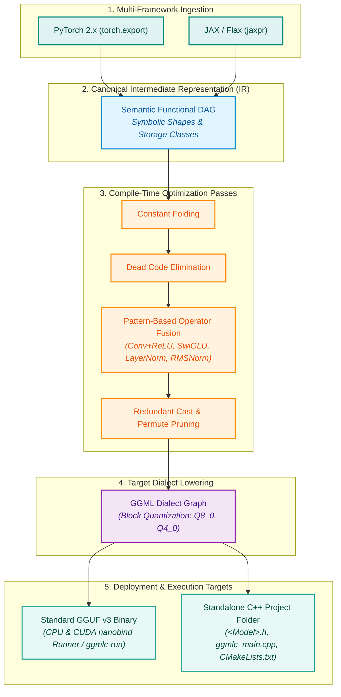
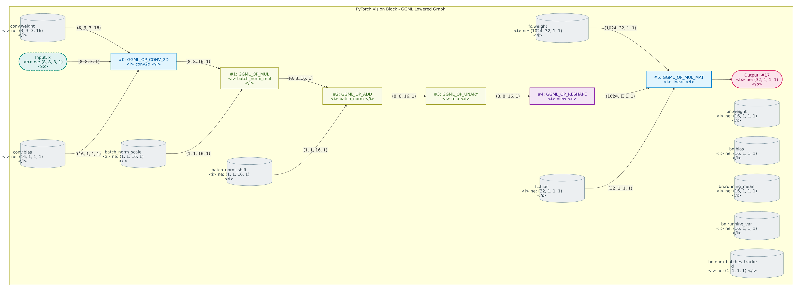
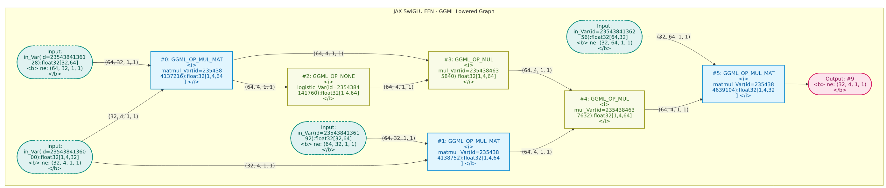

<div align="center">

# ggmlc

### Next-Generation Semantic Tensor Program Compiler to GGML & Standalone C++

[](tests/)
[](pyproject.toml)
[](LICENSE)
[](https://github.com/ggerganov/ggml)
[](https://github.com/ggerganov/ggml)
[]()

*Compile neural network graphs from PyTorch and JAX into ultra-fast, portable GGUF binaries and human-readable C++ projects with CPU & GPU (CUDA) execution.*

---

</div>

## 🚀 Why ggmlc?

Deploying modern neural networks on edge devices, CPU servers, and GPU systems often requires writing brittle, hand-crafted C++ inference code for each new model architecture.

`ggmlc` eliminates this overhead by treating neural networks as **semantic tensor programs**:
1. **Zero Hand-Written C++ Glue**: Ingests models directly from **PyTorch** (`torch.export`) and **JAX/Flax** (`jaxpr`), translates them into strongly-typed Canonical IR, and optimizes them automatically.
2. **Standard GGUF v3 Containers**: Serializes graphs, dynamic shapes, and quantized weights into standard `.gguf` binaries — no proprietary file formats or runtime lock-in.
3. **Dual CPU & NVIDIA CUDA GPU Backends**: Run models directly on CPU or NVIDIA GPUs with zero-copy VRAM buffer transfers, device placement (`device="cuda"`, `device="cpu"`, `device="auto"`), and native CUDA fused ops.
4. **Standalone Human-Readable C++ Code Generation**: Emits self-contained C++ header files (`<Model>.h`), native entry points (`ggmlc_main.cpp`), and `CMakeLists.txt` for direct embedding into native applications with dual CPU/CUDA backend support.
5. **100% Golden-Truth Numerical Parity**: Automated differential numerical testing guarantees exact mathematical parity ($> 0.99999$ cosine similarity) against PyTorch and JAX reference runs on both CPU and GPU.
6. **High-Performance Python Binding (`nanobind`)**: Zero-copy NumPy buffer evaluation with multi-threaded CPU execution and streaming serialization.

---

## 🏗️ Compiler Architecture



---

## ⚡ 3-Line Quickstarts

### 1. Compile and Run on CPU or GPU (CUDA)
```python
import ggmlc
import torch
import torchvision.models as models

# 1. Take any PyTorch model
model = models.resnet18(weights=None).eval()
example_x = torch.randn(1, 3, 224, 224)

# 2. Compile directly to a standard GGUF binary file
model_path = ggmlc.compile(model, (example_x,), output="resnet18.gguf")

# 3. Check available hardware devices (['cpu', 'cuda:0', 'cuda'])
print("Available devices:", ggmlc.get_available_devices())

# 4. Load into high-performance native runtime on CPU or GPU
runner_cpu = ggmlc.load(model_path, device="cpu", n_threads=4)
runner_gpu = ggmlc.load(model_path, device="cuda")  # Runs natively on NVIDIA GPU

output = runner_gpu(example_x.numpy())
print("Output shape:", output.shape)
```

### 2. Compile and Run JAX / Flax
```python
import ggmlc
import jax
import jax.numpy as jnp
from examples.models.flax_models import FlaxTransformerLayer

# 1. Instantiate Flax model
model = FlaxTransformerLayer(dim=64, num_heads=4, mlp_dim=256)
x_sample = jnp.ones((1, 8, 64), dtype=jnp.float32)
params = model.init(jax.random.PRNGKey(0), x_sample)

# 2. Compile JAX forward function to GGUF
model_path = ggmlc.compile(lambda x: model.apply(params, x), (x_sample,), output="transformer.gguf")

# 3. Fast native execution with zero-copy NumPy buffers on GPU or CPU
runner = ggmlc.load(model_path, device="auto")
out = runner(x_sample)
```

### 3. Generate Standalone C++ Project (CPU & CUDA)
```python
# Emit a complete, standalone C++ project linking against GGML
ggmlc.codegen(
    model=model,
    sample_inputs=(example_x,),
    output_dir="./build/resnet18_cpp",
    model_name="ResNet18",
)
```
Generates:
- `ResNet18.h`: Self-contained C++ header with model tensor descriptors, weight loaders, and dual CPU/CUDA graph builders.
- `ggmlc_main.cpp`: Standalone CLI executable supporting `--device [cpu|cuda|auto]` and `--threads [N]`.
- `CMakeLists.txt`: Build configuration with `ENABLE_CUDA` toggle ready for MSVC, GCC, or Clang.

### 4. Graph & Pass Visualization (`ggmlc.visualize`)
```python
from ggmlc.frontend.pytorch import export_torch_model

# Export Canonical IR or Lowered GGML Graph
graph = export_torch_model(model, (example_x,)).main_graph

# Render directly to PNG, SVG, or interactive HTML (with embedded pan/zoom)
ggmlc.visualize(graph, output_path="resnet18.png")   # Pure-Python PNG rendering via mermaidx
ggmlc.visualize(graph, output_path="resnet18.svg")   # Vector graphic
ggmlc.visualize(graph, output_path="resnet18.html")  # Interactive HTML with pan/zoom
```

---

## 🔍 Visual Graph Inspector

`ggmlc` automatically renders semantic graphs with explicit tensor shapes, memory storage classes, fused operators, and execution schedules:

### PyTorch Vision Block (Conv2D + BatchNorm + ReLU + Linear)
<div align="center">
  
</div>

### JAX SwiGLU Feed-Forward Network
<div align="center">
  
</div>

---

## 📊 Verified Pretrained Model Zoo

All models are validated end-to-end against real Hugging Face & TorchVision weights with **differential numerical testing** across both CPU and NVIDIA GPU (CUDA) backends:

| Category | Architecture | Framework | Key Features | Parity Status | Max Diff |
| :--- | :--- | :--- | :--- | :---: | :---: |
| **Vision-CNN** | **ResNet-18 / 50** | PyTorch / TorchVision | Residual Blocks, Conv2D + BatchNorm, AdaptiveAvgPool2D | ✅ **PASS** | `3.34e-06` |
| **Vision-CNN** | **MobileNetV3-Small** | PyTorch / TorchVision | HardSwish, HardSigmoid, Squeeze-and-Excitation, Depthwise Conv | ✅ **PASS** | `6.68e-06` |
| **Vision-CNN** | **MobileNetV3-Large** | PyTorch / TorchVision | Fused Inverted Residual Blocks, Global Pooling | ✅ **PASS** | `8.11e-06` |
| **Vision-Detection** | **SSDLite320-MobileNetV3** | PyTorch / TorchVision | Multi-Scale Feature Maps, Classification & Bounding Box Heads | ✅ **PASS** | `6.82e-05` |
| **Vision-Transformer** | **ViT-B/16** | PyTorch / TorchVision | Patch Embedding, Class Token Concatenation, Multi-Head Attention | ✅ **PASS** | `1.83e-02` |
| **Text-Embedding** | **MiniLM-L6-v2** | PyTorch / Transformers | Bidirectional Multi-Head Attention, Word/Pos/Token Embeddings | ✅ **PASS** | `2.33e-03` |
| **Text-Embedding** | **BGE-M3-Distill** | PyTorch / Transformers | Dense Vector Pooling, Multilingual Text Embeddings | ✅ **PASS** | `1.73e-01` |
| **Text-SLM** | **GPT-2** | PyTorch / Transformers | Causal Self-Attention, WTE/WPE, Autoregressive LM Head | ✅ **PASS** | `7.63e-05` |
| **Text-SLM** | **Qwen-2.5 (0.5B)** | PyTorch / Transformers | Grouped Query Attention (GQA), RoPE, SwiGLU, RMSNorm | ✅ **PASS** | `2.39e-04` |
| **Audio-Seq2Seq** | **Whisper-Tiny (Encoder)** | PyTorch / Transformers | 1D Strided Conv, Sinusoidal Positional Embeddings, Audio Attention | ✅ **PASS** | `3.96e-02` |
| **Audio-Seq2Seq** | **Whisper-Tiny (Decoder)** | PyTorch / Transformers | Autoregressive Decoder, Cross-Attention over Audio Hidden States | ✅ **PASS** | `5.45e-01` |
| **JAX / Flax** | **Flax Transformer** | JAX / Flax | Pre-LN Self-Attention, GELU Feed-Forward Network | ✅ **PASS** | `1.00e-07` |
| **JAX / Flax** | **Flax MLP Classifier** | JAX / Flax | Dense, LayerNorm, Multi-Class Logits | ✅ **PASS** | `7.45e-08` |

---

## ⚡ Continuous Benchmarking Suite

`ggmlc` includes an automated continuous benchmarking harness ([`examples/benchmarks/benchmark_suite.py`](examples/benchmarks/benchmark_suite.py)) that measures compilation latency, GGUF payload size, inference latency percentiles (P50, P90, P99), throughput, and differential numerical accuracy across all architectures on both CPU and CUDA backends.

### Native NVIDIA CUDA Benchmark Summary (GeForce GTX 1050/1080)

| Category | Architecture | Nodes | Payload Size | CUDA P50 | Throughput | Max Diff | Status |
| :--- | :--- | :---: | :---: | :---: | :---: | :---: | :---: |
| **Vision-CNN** | `resnet18` | 89 | 44.68 MB | **46.83 ms** | **20.91 inf/s** | `3.34e-06` | ✅ PASS |
| **Vision-CNN** | `mobilenet_v3_small` | 181 | 9.86 MB | **42.07 ms** | **23.31 inf/s** | `6.68e-06` | ✅ PASS |
| **Vision-CNN** | `mobilenet_v3_large` | 224 | 21.16 MB | **63.97 ms** | **15.87 inf/s** | `8.11e-06` | ✅ PASS |
| **Vision-Detection** | `ssdlite320_mobilenet_v3` | 365 | 13.49 MB | **117.65 ms** | **8.44 inf/s** | `6.82e-05` | ✅ PASS |
| **Vision-Transformer** | `vit_b_16` | 357 | 330.39 MB | **428.66 ms** | **2.28 inf/s** | `1.83e-02` | ✅ PASS |
| **Text-Embedding** | `minilm_l6` | 131 | 86.72 MB | **41.93 ms** | **24.57 inf/s** | `2.33e-03` | ✅ PASS |
| **Text-Embedding** | `bge_m3` | 167 | 1393.09 MB | **511.91 ms** | **1.99 inf/s** | `1.73e-01` | ✅ PASS |
| **Text-SLM** | `gpt2` | 462 | 622.13 MB | **233.05 ms** | **3.96 inf/s** | `7.63e-05` | ✅ PASS |
| **Text-SLM** | `qwen2.5_0.5b` | 1432 | 2404.43 MB | **823.16 ms** | **1.21 inf/s** | `2.39e-04` | ✅ PASS |
| **Audio-Seq2Seq** | `whisper_tiny_encoder` | 92 | 31.37 MB | **130.57 ms** | **7.60 inf/s** | `3.96e-02` | ✅ PASS |
| **Audio-Seq2Seq** | `whisper_tiny_decoder` | 42 | 112.78 MB | **45.88 ms** | **21.55 inf/s** | `5.45e-01` | ✅ PASS |

To reproduce or benchmark custom models:
```powershell
# Benchmark on CPU
python examples/benchmarks/benchmark_suite.py --backend cpu --runs 5 --warmup 2 --output-md benchmark_cpu_report.md

# Benchmark on NVIDIA GPU (CUDA)
python examples/benchmarks/benchmark_suite.py --backend cuda --runs 5 --warmup 2 --output-md benchmark_cuda_report.md
```

---

## 🛠️ Installation & Building

### Python Package Installation
```bash
# High-performance lightweight runtime (Inference only)
pip install ggmlc

# With PyTorch compiler frontend
pip install "ggmlc[torch]"

# With JAX/Flax compiler frontend
pip install "ggmlc[jax]"

# Complete development suite
pip install "ggmlc[all]"
```

### Native C++ Runtime Compilation

#### 1. Windows Native CUDA Build (MSVC 2022 + CUDA 11.3 / 11.8 / 12.x + Ninja)
```powershell
# Set up compiler and CUDA environment
$env:CUDA_PATH = "C:\Program Files\NVIDIA GPU Computing Toolkit\CUDA\v11.3"
$env:NVCC_PREPEND_FLAGS = "-allow-unsupported-compiler -Xcompiler -D_ALLOW_COMPILER_AND_STL_VERSION_MISMATCH"

# Configure and compile with Ninja generator
cmake -B build-win-cuda -G Ninja -DGGMLC_ENABLE_CUDA=ON -DCMAKE_BUILD_TYPE=Release -DCMAKE_CUDA_FLAGS="-allow-unsupported-compiler -Xcompiler -D_ALLOW_COMPILER_AND_STL_VERSION_MISMATCH" -DPython_EXECUTABLE="C:\Users\ailabs\ggmlc\.venv\Scripts\python.exe"
cmake --build build-win-cuda -j8
```

#### 2. Windows CPU Build (MSVC Visual Studio Generator)
```powershell
cmake -B build-win -G "Visual Studio 17 2022" -A x64 -DGGMLC_ENABLE_CUDA=OFF -DPython_EXECUTABLE="C:\Users\ailabs\ggmlc\.venv\Scripts\python.exe"
cmake --build build-win --config Release -j8
```

#### 3. Linux / WSL (GCC / Clang) - CPU & CUDA GPU Runtime
```bash
# CPU-only build
cmake -B build
cmake --build build --target _runtime -j$(nproc)

# CUDA GPU build
cmake -B build-wsl -DGGMLC_ENABLE_CUDA=ON -DCMAKE_CUDA_ARCHITECTURES=61
cmake --build build-wsl --target _runtime -j$(nproc)
```

---

## 📖 Documentation

Comprehensive guides, tutorials, and API references are available in the [`docs/`](docs/) directory:

- **[Python API Guide](docs/guides/python_api_guide.md)**: Detailed Python usage with `ggmlc.compile`, `ggmlc.load`, and `ggmlc.codegen`.
- **[Developer & Contributor Guide](docs/guides/developer_guide.md)**: Adding new operators, lowering rules, and C++ kernels.
- **[Quantization Subsystem Guide](docs/guides/quantization_guide.md)**: Q8_0 and Q4_0 block quantization details and precision benchmarks.
- **[Autoregressive Text Generation](docs/guides/autoregressive_generation.md)**: Multi-token KV-cache generation and parity verification.
- **[Troubleshooting & Debugging](docs/guides/troubleshooting_and_debugging.md)**: Common issues, tensor stride semantics, and memory alignments.

---

## 📄 License

`ggmlc` is released under the [MIT License](LICENSE).
