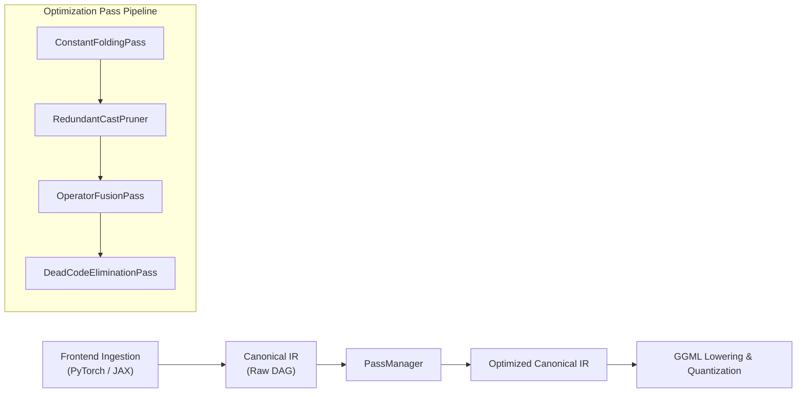
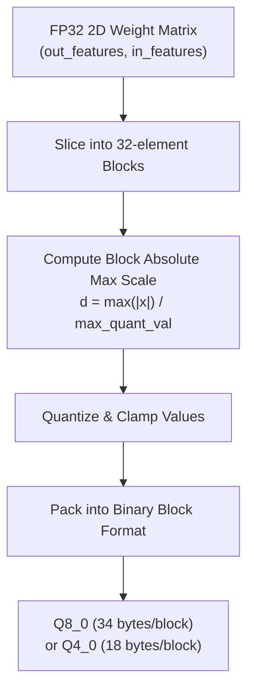

# Architecture: Optimization Passes & Quantization Pipeline

This document details the architecture and design principles of `ggmlc`'s **Transformation Pass Pipeline** and **Block Quantization Subsystem**.

---

## 1. Transformation Pass Pipeline

`ggmlc` applies graph optimizations directly on the framework-independent **Canonical IR** prior to target dialect lowering. This ensures optimization logic remains generic and independent of execution backends.

### Core Architecture Components (`ggmlc.transforms`)

1. **`Pass` Base Class (`python/ggmlc/transforms/base.py`)**:
   - Every transformation implements `run(graph: Graph) -> GraphTransformResult`.
   - Returns a new immutable or modified `Graph` together with `PassStats` (duration, node counts, fusions applied, constants folded).

2. **`PassManager` (`python/ggmlc/transforms/manager.py`)**:
   - Sequential pipeline runner that accepts an arbitrary list of passes.
   - Enforces graph invariant validation (`graph.validate()`) between passes to detect dangling edges or missing tensor declarations early.

3. **`ConstantFoldingPass` (`python/ggmlc/transforms/constant_folding.py`)**:
   - Indexes compile-time constant tensors (`StorageClass.CONSTANT`).
   - Recursively evaluates deterministic subgraphs consisting of shape arithmetic, slicing, transpositions, and scalar scaling.
   - **Critical Design Guard**: Only tracks `StorageClass.CONSTANT` to avoid copying large weight arrays (`StorageClass.PARAMETER`, e.g. 124M+ floats) into constant dictionaries.

4. **`DeadCodeEliminationPass` (`python/ggmlc/transforms/dce.py`)**:
   - Performs backward reachability traversal from designated graph roots: `graph.outputs` and `graph.states` (persistent state tensors like KV caches).
   - Prunes unreferenced operations, orphan activation tensors, and dead control-flow branches.

5. **`OperatorFusionPass` (`python/ggmlc/transforms/fusion.py`)**:
   - Pattern matches composite operator sequences and replaces them with unified operations:
     - `Conv2D + ReLU` $\to$ fused Conv2D activation.
     - `Linear + Bias` $\to$ fused `MATMUL` with bias input.
     - `SwiGLU`: Detects $x \cdot \text{silu}(g)$ and emits a single composite `SILU` / `MUL` sequence.

6. **`RedundantCastPruner` (`python/ggmlc/transforms/redundant.py`)**:
   - Detects and removes identity permutations (`dims == [0, 1, 2, ...]`).
   - Eliminates redundant casts between identical source and destination dtypes (`cast(F32, F32)`).

---

## 2. Block Quantization Subsystem

Quantization in `ggmlc` reduces weight memory footprint and bandwidth demands during matrix multiplications while preserving full FP32 activation dynamic range.

### Supported Quantization Formats (`ggmlc.quantization`)

| Format | Block Size | Block Payload Layout | Storage Size | Theoretical Compression |
| :--- | :--- | :--- | :--- | :--- |
| **`Q8_0`** | 32 floats | 1 $\times$ `fp16` scale + 32 $\times$ `int8` quants | 34 bytes / block | $\mathbf{3.76\times}$ |
| **`Q4_0`** | 32 floats | 1 $\times$ `fp16` scale + 16 $\times$ packed 4-bit nibbles | 18 bytes / block | $\mathbf{7.11\times}$ |

#### Block Mathematics

1. **Q8_0**:
   $$\text{scale } d = \frac{\max_{i} |x_i|}{127.0}$$
   $$q_i = \text{clamp}\left(\text{round}\left(\frac{x_i}{d}\right), -128, 127\right)$$
   $$\hat{x}_i = q_i \times d$$

2. **Q4_0**:
   $$\text{scale } d = \frac{\max_{i} |x_i|}{-8.0}$$
   $$q_i = \text{clamp}\left(\text{round}\left(\frac{x_i}{d}\right) + 8, 0, 15\right)$$
   Nibbles are packed pairwise: low nibble $q_{2k}$, high nibble $q_{2k+1} \ll 4$.
   $$\hat{x}_i = (q_i - 8) \times d$$

---

## 3. Mixed-Precision & Weight Alignment Policies

To ensure numerical stability and correct runtime execution:

1. **2D/3D Weight Matrices Only**:
   - Only 2D parameter weights (e.g. GEMM projections, attention projections, MLP layers) with $N \ge 128$ and $N \pmod{32} == 0$ are quantized.
2. **1D Biases & Normalizations Stay FP32**:
   - 1D biases (`[out_features]`) and normalization parameters (LayerNorm $\gamma/\beta$, RMSNorm scales) remain `F32` to avoid drift in small vectors.
3. **Activation Paths Stay FP32**:
   - Inputs, intermediate activations, and KV cache states remain full `F32`.
4. **32-Byte Container Alignment**:
   - In serialized GGUF v3 (`.gguf`) binary containers, all quantized and raw parameter payloads are padded to 32-byte boundaries for AVX-512 / AVX2 / NEON alignment.

---

## 4. Generic C++ Runtime Integration

The C++ generic runtime (`ggmlc::Executor`) transparently executes quantized models:
- **Memory Allocation**: Computes context buffers using `ggml_type_size(type)` and `ggml_blck_size(type)`:
  $$\text{bytes} = \frac{\text{numel}}{\text{blck\_size}(\text{type})} \times \text{type\_size}(\text{type})$$
- **Kernel Dispatch**: In `GGML_OP_MUL_MAT`, quantized weight tensors are dispatched directly to hardware-accelerated dot-product kernels without calling non-contiguous transformation helpers (`ggml_cont` or `ggml_transpose`).
