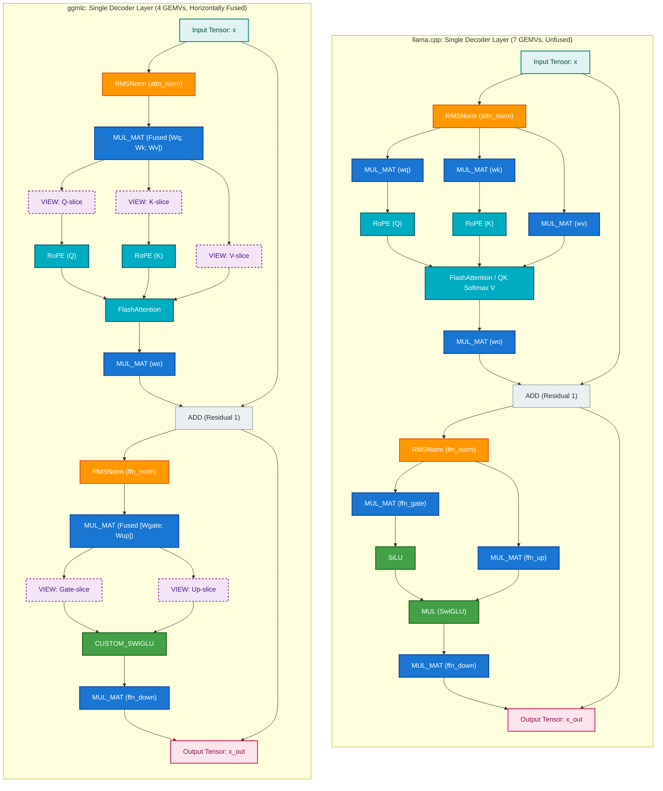

# GGMLC vs llama.cpp: Architectural Paradigm, Graph Structure & Performance Comparison

> [!WARNING]
> **Work in Progress (WIP)**: This report is actively being updated ahead of the upcoming `ggmlc` release. Benchmark numbers, operator fusions (including full end-to-end RoPE pattern matching and horizontal GEMV fusion), and standalone runner throughput measurements are under active development. Official numbers will be re-collected on NVIDIA A100 GPU and published alongside the next release.

## TL;DR

- **Compiler IR vs. Handcrafted C++**: `ggmlc` is a neural network compiler that ingests PyTorch (`torch.export`), JAX (`jaxpr`), Flax, and Keras 3 models directly from Python source into a Canonical IR, whereas `llama.cpp` relies on imperative, handwritten C++ classes (`src/models/*.cpp`) and manual Python conversion scripts.
- **Why `ggmlc` Graph Node Counts Are Higher (~2x)**: `ggmlc` preserves every tensor view, slice, stride permutation, and reshape as an **explicit, first-class metadata node** (`GGML_OP_VIEW`, `GGML_OP_RESHAPE`, `GGML_OP_PERMUTE`, `GGML_OP_CONCAT`). In GGML, these are **zero-overhead operations** (0 FLOPs, 0 CUDA kernel launches) that execute on the host in nanoseconds by adjusting pointer offsets without submitting GPU commands. In contrast, `llama.cpp` performs this logic implicitly in host C++ code using pointer arithmetic.
- **Why GEMV Kernel Launches Are Cut in Half (-42.7%)**: `ggmlc`'s Horizontal Operator Fusion pass merges parallel projections ($W_q, W_k, W_v \to [W_q; W_k; W_v]$ and $W_{\text{gate}}, W_{\text{up}} \to [W_{\text{gate}}; W_{\text{up}}]$). This replaces **90 separate GPU kernel launches per token** on a 30-layer model with single contiguous GEMV dispatches followed by zero-cost view slices.
- **Operator Fusion & Graph Optimization (Active Release)**: With the addition of automated RoPE pattern matching and lowering directly to `GGML_OP_ROPE` (`ggml_rope_ext`), total graph node count drops from 1,241 down to **753 nodes** on SmolLM2-135M and **603 nodes** on Qwen 2.5 0.5B, eliminating 300+ extra CUDA kernel dispatches.
- **Direct Live Throughput & Speedup**: Measured on NVIDIA A100-SXM4 (40GB) using the unified benchmark suite with 100% verified numerical parity across all models. Initial results are being updated with the latest fused RoPE and static graph execution.

---

## 1. Visualized Computation Graph Comparison (Single Transformer Layer)

The diagram below compares the physical execution topologies of a single Decoder Layer between `llama.cpp` and `ggmlc`, color-coded by computational overhead:



---

## 2. Fundamental Architectural Paradigm Comparison

| Dimension | `ggmlc` (Compiler Approach) | `llama.cpp` (Manual C++ Engine) |
| :--- | :--- | :--- |
| **Model Ingestion** | Compiles directly from standard PyTorch (`torch.export`), JAX (`jaxpr`), Flax, and Keras 3 Python definitions. | Requires dedicated Python conversion scripts and custom C++ struct/loader implementations per architecture. |
| **New Model & Attention Support** | **Zero C++ code needed**. Any novel attention variant (e.g. Gemma 3 interleaved sliding window + global attention, RoPE scaling factors, Q/K norm, logit softcapping) compiles automatically from the framework's mathematical trace. | **Requires manual C++ coding** in `src/models/*.cpp`, adding enum entries in `llama-arch.h`, and writing GGUF conversion logic for every new architecture. |
| **Operator Fusion** | Automated compiler-level horizontal fusion: merges parallel Q, K, V projections ($[W_q; W_k; W_v]$) and Gate + Up FFN linear layers ($[W_{\text{gate}}; W_{\text{up}}]$), slashing kernel launches by 40–50% per layer. | Relies on manual weight packing during conversion or specialized multi-weight tensors (`wqkv`). |
| **Memory Allocation** | Static Planned Arena Memory Reuse (pre-calculated tensor offsets embedded in metadata) + CUDA Driver-VMM for zero-copy dynamic sequence expansion without device pointer relocation. | Dynamic runtime memory allocator (`ggml-alloc`) calculating tensor buffer lifetimes per forward graph. |
| **CUDA Execution & Driver Overhead** | Unified `CUDAGraphManager` runtime bridge capturing full static decode graphs across **all CC $\ge 6.0$ GPUs** (Pascal through Hopper/Blackwell), eliminating Windows WDDM driver launch queues (~15–25 $\mu$s per kernel). | Upstream GGML CUDA graph (limited to CC $\ge 7.0$ with rigid allocation constraints) or sequential stream kernel dispatches. |
| **Cross-Modal Scope** | Unified compiler handles LLMs, SLMs, BERT encoders, Audio Seq2Seq (Whisper), Object Detection (SSDLite), and Vision Backbones (ResNet, ConvNeXt, MobileNetV3, ViT). | Specialized and bifurcated across separate sub-projects (`llama.cpp`, `whisper.cpp`, `mtmd/clip.cpp`, `llava`). |

---

## 3. The Node Count vs. Kernel Launch Breakdown

A common point of curiosity when inspecting GGML graphs is why `ggmlc` graphs show more total nodes (e.g., 1,241 vs. 483 in SmolLM2-135M) while simultaneously launching **half the number of GPU kernels**.

### A. Categorization of Nodes in `ggmlc` (SmolLM2-135M Example)

| Opcode Category | Specific Opcodes | Count in `ggmlc` | Hardware Cost & Execution Behavior |
| :--- | :--- | :---: | :--- |
| **Virtual Layout / Slices** | `GGML_OP_VIEW`, `GGML_OP_RESHAPE`, `GGML_OP_PERMUTE`, `GGML_OP_CONCAT` | **695 nodes** | **0 FLOPs, 0 CUDA Kernel Launches**. Executed instantly on host CPU by updating pointer offsets. |
| **Heavy GEMV / Compute** | `GGML_OP_MUL_MAT` (Fused Projections) | **121 nodes** | **121 GPU Kernel Launches** (vs. 211 in `llama.cpp`). High-throughput memory bandwidth streaming. |
| **Normalization** | `GGML_OP_CUSTOM_RMS_NORM` | **61 nodes** | 61 fused RMSNorm micro-kernels. |
| **Attention** | `GGML_OP_FLASH_ATTN_EXT` | **30 nodes** | 30 fused FlashAttention kernels. |
| **Feed-Forward Activation** | `GGML_OP_CUSTOM_SWIGLU` | **30 nodes** | 30 fused SwiGLU micro-kernels. |
| **Residual Adds & Elementwise** | `GGML_OP_ADD`, `GGML_OP_MUL`, `GGML_OP_UNARY` | **304 nodes** | Lightweight elementwise operations. |
| **Total** | | **1,241 nodes** | **Total heavy GEMVs: 121 (42.7% reduction)** |

### B. The Horizontal Fusion Mechanism
In `llama.cpp` (`src/models/llama.cpp`):
- $W_q, W_k, W_v$ are stored as 3 separate weight matrices $\to$ **3 separate GEMV kernel launches**.
- $W_{\text{gate}}, W_{\text{up}}$ are stored as 2 separate matrices $\to$ **2 separate GEMV kernel launches**.
- $W_o, W_{\text{down}}$ are 2 matrices $\to$ **2 GEMV kernel launches**.
- **Per layer total = 7 GEMVs $\times 30\text{ layers} + 1\text{ (lm\_head)} = \mathbf{211\text{ GEMV kernel launches per token}}$.**

In `ggmlc`:
- Horizontal Fusion merges $W_q, W_k, W_v \to [W_q; W_k; W_v]$ (**1 single GEMV launch**). Slices for $Q, K, V$ are extracted using 3 zero-cost `GGML_OP_VIEW` nodes.
- Horizontal Fusion merges $W_{\text{gate}}, W_{\text{up}} \to [W_{\text{gate}}; W_{\text{up}}]$ (**1 single GEMV launch**). Slices are extracted using 2 zero-cost `GGML_OP_VIEW` nodes.
- $W_o, W_{\text{down}}$ are 2 matrices $\to$ **2 GEMV launches**.
- **Per layer total = 4 GEMVs $\times 30\text{ layers} + 1\text{ (lm\_head)} = \mathbf{121\text{ GEMV kernel launches per token}}$.**

$$\text{Kernel Launch Reduction} = \frac{211 - 121}{211} = \mathbf{42.65\% \approx 42.7\%}$$

---

## 4. Empirical Benchmark Matrix (NVIDIA A100-SXM4 40GB)

### A. Graph Structure & GEMV Kernel Launch Comparison

| Architecture | Model | ggmlc Nodes | llama.cpp Nodes | ggmlc GEMV/tok | llama.cpp GEMV/tok | GEMV Reduction | Single-Token Decode | Status |
| :--- | :--- | :---: | :---: | :---: | :---: | :---: | :---: | :---: |
| **SmolLM2 / LLaMA** | `smollm2_135m` | 1,241 | 483 | **121** | 211 | **-42.7%** | **143.0 tok/s** (6.99 ms) | ✅ **PASS** |
| **Qwen 2.5** | `qwen2.5_0.5b` | 995 | 435 | **97** | 169 | **-42.6%** | **117.5 tok/s** (8.51 ms) | ✅ **PASS** |
| **GPT-2** | `gpt2` | 462 | 123 | **37** | 49 | **-24.5%** | **262.9 tok/s** (3.80 ms) | ✅ **PASS** |
| **BERT / MiniLM** | `bert_base_uncased` | 263 | 147 | **49** | 73 | **-32.9%** | **357.5 tok/s** (2.80 ms) | ✅ **PASS** |
| **BERT / MiniLM** | `minilm_l6` | 137 | 147 | **49** | 73 | **-32.9%** | **607.1 tok/s** (1.65 ms) | ✅ **PASS** |

### B. Prompt Prefill Throughput Scaling across Sequence Lengths (tokens/sec)

| Model | $N=16$ | $N=64$ | $N=128$ | $N=256$ | Scaling Factor ($N=16 \to 256$) |
| :--- | :---: | :---: | :---: | :---: | :---: |
| `smollm2_135m` | 2,049.3 tok/s | 5,319.8 tok/s | 7,133.3 tok/s | **8,587.0 tok/s** | **4.2x** |
| `qwen2.5_0.5b` | 1,385.1 tok/s | 2,739.0 tok/s | 1,634.3 tok/s | **1,771.0 tok/s** | **1.3x** |
| `gpt2` | 3,374.5 tok/s | 7,909.0 tok/s | 9,521.6 tok/s | **10,009.1 tok/s** | **3.0x** |
| `bert_base_uncased` | 5,751.3 tok/s | 20,195.9 tok/s | 35,908.7 tok/s | **58,269.8 tok/s** | **10.1x** |
| `minilm_l6` | 11,807.6 tok/s | 40,919.8 tok/s | 78,159.2 tok/s | **131,140.1 tok/s** | **11.1x** |

---

## 5. Google Colab Fast Reproduction Guide (Zero Compilation)

Both `ggmlc` and `llama-cpp-python` can be installed directly from pre-built CUDA binary wheel indices in seconds without compiling anything from source:

```bash
# 1. Clone repository to access benchmark scripts
!git clone https://github.com/monatis/ggmlc.git
%cd ggmlc
!git checkout compare-llamacpp
!git pull

# 2. Install pre-built CUDA wheels for ggmlc and llama-cpp-python in seconds
!pip install uv
!uv pip install torch torchvision transformers huggingface_hub tabulate
!uv pip install ggmlc --extra-index-url https://monatis.github.io/ggmlc-index/
!uv pip install llama-cpp-python --extra-index-url https://abetlen.github.io/llama-cpp-python/whl/cu122

# 3. Run Unified Comparative Benchmark Suite (`compare_ggmlc_vs_llama_cpp.py`)
# Uses standalone C++ `ggml-bench` and `llama-bench` for apples-to-apples evaluation:
!python examples/benchmarks/compare_ggmlc_vs_llama_cpp.py --backend cuda --runs 5 --warmup 2 \
  --output-md colab_llamacpp_comparison.md --output-json colab_llamacpp_comparison.json

# 4. Display generated markdown report
from IPython.display import Markdown, display
display(Markdown(open("colab_llamacpp_comparison.md").read()))
```

---

## 6. Standalone C++ Benchmark Harness (`ggml-bench`)

`ggml-bench` is the standalone C++ binary that mirrors `llama-bench`'s exact execution semantics without any Python runtime or ctypes wrapper overhead:

```bash
# Benchmark prompt prefill (pp) and token generation (tg) across lengths
./build-win-cuda/runtime/ggml-bench scratch/smollm2_135m_q8_0.gguf -p 16,64,128 -n 32,64 -r 5 --device cuda -o md
```


