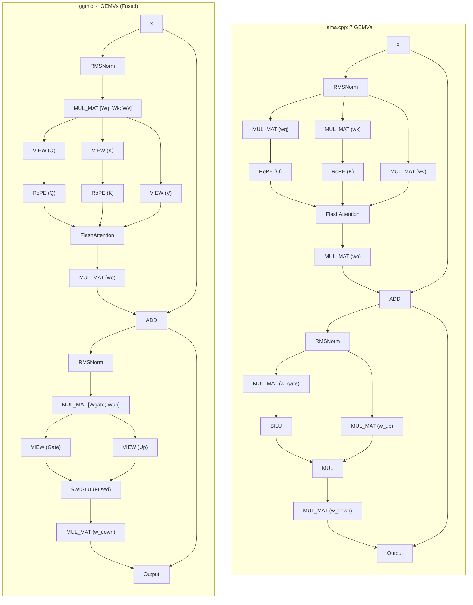

# `ggmlc` vs. `llama.cpp`: Architecture and Performance

Comparing compiler-generated GGML execution graphs (`ggmlc`) against hand-written C++ implementations (`llama.cpp`).

## Summary

- **Approach**: `ggmlc` compiles models directly from PyTorch (`torch.export`) and JAX (`jaxpr`) traces into GGML graphs with automated optimization passes (horizontal fusion, view folding). `llama.cpp` implements models as hand-written C++ classes.
- **Graph structure**: `ggmlc` has ~1.5x–2x more graph nodes because tensor views, slices, and reshapes are explicit `GGML_OP_VIEW` nodes. In GGML, views cost 0 FLOPs and dispatch 0 GPU kernels (host pointer math only).
- **Kernel launches**: Horizontal fusion merges parallel projections ($W_q, W_k, W_v$ and $W_{\text{gate}}, W_{\text{up}}$), cutting GEMV dispatches by 40%–43% (4 vs 7 GEMVs per layer, saving 90 kernel launches per token on 30 layers).
- **Performance parity (RTX 4050 Laptop, CUDA 12.8, Q8_0)**:
  - **Short prefill ($P \le 256$)**: `ggmlc` is **1.06x–1.23x faster** due to fewer Windows WDDM kernel launch stalls.
  - **Single chunk ($P = 512$)**: **0.89x–0.98x parity** (compute-bound cuBLAS GEMM / FlashAttention). Remaining gap is lowering/layout, not host masks.
  - **Multi-chunk ($P = 1024$, `ubatch 512`)**: **0.71x–0.80x parity** using in-place chunk graph caching.
  - **Decode ($S = 1$)**: **~1.0x parity** after llama.cpp-style `ggml_set_rows` KV writes + padded `n_kv` (CUDA graphs stay warm). SmolLM2-135M: **287 tok/s vs llama.cpp 279 tok/s (1.03x)**. SmolLM2-360M live decode **192.5 tok/s** vs frozen-graph replay **196.5 tok/s** (was 140 tok/s with mutating `view+cpy`).
- **Extensibility**: Non-standard attention patterns (GQA, QK-norm, sliding window, MLA) compile directly from reference Python code without new C++ runtime kernels.

---

## 1. Architectural Comparison

| Dimension | `ggmlc` | `llama.cpp` |
| :--- | :--- | :--- |
| **Model Ingestion** | Compiles PyTorch (`torch.export`) and JAX (`jaxpr`) traces. | Custom Python conversion scripts (`convert_hf_to_gguf.py`). |
| **Model Implementation** | Zero model C++. Generic runtime executes any valid GGUF graph. | Hand-written C++ class per architecture (`src/models/*.cpp`). |
| **Operator Fusion** | Automated compiler passes (horizontal GEMV, affine view folding, SwiGLU). | Manual weight packing during conversion or bespoke multi-weight tensors. |
| **KV Cache** | Graph-bound tensors: decode uses `ggml_set_rows` into a padded `n_kv` view (CUDA-graph stable); prefill still uses view+cpy + Driver-VMM pages. | External C++ ring buffer (`struct llama_kv_cache`) with `ggml_set_rows` and `n_kv` padded to 256. |
| **CUDA Execution** | `CUDAGraphManager` (stream capture across CC $\ge 6.0$) + generic graph compute. | GGML CUDA graph (CC $\ge 7.0$) or sequential stream dispatches. |
| **Scope** | Unified compiler for LLMs, SLMs, BERT, Whisper, and vision backbones. | Specialized C++ implementations for LLMs, audio, and multimodal. |

---

## 2. Graph Topologies: Single Decoder Layer

Structural comparison of a single Transformer decoder layer (LLaMA / SmolLM2):



### Operator Mapping

| Block | `llama.cpp` | `ggmlc` | Note |
| :--- | :--- | :--- | :--- |
| **Q/K/V Projections** | 3 `MUL_MAT` | 1 fused `MUL_MAT` + 3 `VIEW` | Horizontal fusion merges parallel weights on dim 0. |
| **RoPE** | `ggml_rope_ext` | `ggml_rope_ext` on Q, K views | Identical kernel. |
| **Self-Attention** | `ggml_flash_attn_ext` | `ggml_flash_attn_ext` | Identical kernel. |
| **Output Projection** | 1 `MUL_MAT` | 1 `MUL_MAT` | Identical. |
| **FFN Gate / Up** | 2 `MUL_MAT` | 1 fused `MUL_MAT` + 2 `VIEW` | Horizontal fusion merges Gate and Up. |
| **Activation** | `SILU` + elementwise `MUL` | Fused `SWIGLU` | Single-pass activation. |
| **FFN Down** | 1 `MUL_MAT` | 1 `MUL_MAT` | Identical. |

### Node Count vs. Kernel Launches

- **Views are zero-cost**: Slicing $[W_q; W_k; W_v]$ creates 3 `GGML_OP_VIEW` nodes. In GGML, views do not launch GPU kernels; they compute host-side pointer offsets in ~10 ns.
- **Fewer GPU dispatches**: `ggmlc` dispatches 4 GEMVs per layer vs. 7 in `llama.cpp`.
- **WDDM queue latency**: On Windows, each kernel launch incurs ~15–20 $\mu$s driver queue latency. Saving 90 launches per token on a 30-layer model saves ~1.5 ms CPU stall time.

---

## 3. Frontend Canonicalization

```
PyTorch export (ATen) \
                       --> Canonical IR --> Optimization passes --> GGML graph
JAX jaxpr (XLA)       /
```

PyTorch and JAX traces normalize into a common Canonical IR (`OpCode.MATMUL`, `OpCode.SDPA`). Bitwise and differential tests verify numerical parity across both frontends on equivalent blocks (MLP, ResNet Residual, LayerNorm).

---

## 4. Attention Variants

| Variant | Models | `llama.cpp` | `ggmlc` |
| :--- | :--- | :--- | :--- |
| **GQA / MQA** | LLaMA 3.2, Qwen 2.5, SmolLM2 | Manual head broadcast logic in C++. | Canonicalized to `OpCode.SDPA(enable_gqa=True)` $\to$ `GGML_OP_FLASH_ATTN_EXT`. |
| **QK Normalization** | Qwen 2.5, Gemma 3 | Custom C++ inserting RMSNorm before RoPE. | Traced automatically; lowered as standard RMSNorm nodes. |
| **Sliding Window (SWA)** | Mistral, Gemma 3 | Custom C++ ring-buffer offset math. | Banded causal mask or FlashAttention window attribute. |
| **Logit Softcapping** | Gemma 2 / 3 | C++ conditional passing `logit_softcap` float. | Extracted from attention attributes to `ggml_flash_attn_ext`. |
| **MLA** | DeepSeek V2 / V3 | Custom C++ (`models/deepseek.cpp`). | Decomposes into standard matrix multiplies and split view projections. |

Non-standard attention variants compile directly from Python reference code without custom C++ runtime logic.

---

## 5. Multi-Backend Support

- **CPU**: Standard `ggml-cpu` microkernels (AVX2, FMA, AVX-512).
- **CUDA**: `CUDAGraphManager` (stream capture across CC $\ge 6.0$) + Driver-VMM virtual page mapping (`cuMemMap`).
- **Other Backends**: Emits standard GGUF files with valid GGML graphs, executable on Metal or Vulkan via the GGML backend API.

---

## 6. Benchmarks (RTX 4050 Laptop, CUDA 12.8)

- **Hardware**: NVIDIA GeForce RTX 4050 Laptop (6 GB GDDR6, 96-bit bus, ~192 GB/s peak).
- **Setup**: Windows 11, CUDA 12.8, Driver 572.16. Standalone C++ harnesses (`ggmlc-bench.exe` vs. `llama-bench.exe`), 4 threads, `ubatch = 512`, `Q8_0`.

### Prefill Throughput ($P$ Tokens, `ubatch = 512`)

| Model | $P$ | `ggmlc` (tok/s) | `llama.cpp` (tok/s) | Ratio | Regime |
| :--- | :---: | :---: | :---: | :---: | :--- |
| **smollm2_360m** | 16 | **3,523.3** | 2,894.2 | **1.22x** | Launch-bound (fusion win) |
| | 64 | **10,594.2** | 9,568.9 | **1.11x** | Launch-bound |
| | 128 | **14,981.5** | 14,570.9 | **1.03x** | Parity |
| | 256 | **22,828.9** | 19,738.2 | **1.16x** | Compute-bound |
| | 512 | 21,897.2 | 23,100.2 | **0.95x** | Single full chunk |
| | 1024 | 16,983.9 | 21,198.8 | **0.80x** | Multi-chunk in-place cached (+58% vs un-cached) |
| **qwen2.5_0.5b** | 16 | **3,258.0** | 2,645.9 | **1.23x** | Launch-bound (fusion win) |
| | 64 | **10,642.0** | 8,677.2 | **1.23x** | Launch-bound |
| | 128 | **15,271.3** | 13,655.5 | **1.12x** | Compute transition |
| | 256 | 18,720.8 | 19,104.4 | **0.98x** | Parity |
| | 512 | 18,432.5 | 20,349.8 | **0.91x** | Compute-bound |
| | 1024 | 14,257.6 | 20,119.2 | **0.71x** | Multi-chunk in-place cached (+45% vs un-cached) |
| **gpt2_medium** | 16 | **3,482.3** | 3,192.7 | **1.09x** | Launch-bound |
| | 64 | 10,213.0 | 10,613.3 | **0.96x** | Parity |
| | 128 | 14,343.1 | 16,117.3 | **0.89x** | Compute-bound |
| | 256 | 19,892.9 | 21,427.8 | **0.93x** | Near parity |
| | 512 | 20,058.0 | 22,650.6 | **0.89x** | Near parity |
| | 1024 | 16,415.7 | 20,902.2 | **0.79x** | Multi-chunk in-place cached (+43% vs un-cached) |
| **llama3.2_1b** | 16 | **1,551.8** | 1,414.9 | **1.10x** | Launch-bound |
| | 64 | **5,315.7** | 4,986.1 | **1.07x** | Parity |
| | 128 | **9,195.7** | 8,648.4 | **1.06x** | Parity |
| | 256 | 9,645.9 | 10,181.6 | **0.95x** | Parity |
| | 512 | 9,497.9 | 10,698.5 | **0.89x** | Compute-bound |
| | 1024 | 8,046.0 | 10,554.2 | **0.76x** | Multi-chunk in-place cached (+13% vs un-cached) |

### Decode Throughput ($S = 1$, Memory Bandwidth Bound)

Single-token decode has arithmetic intensity $\approx 1.0\text{ FLOP/Byte}$. The table below is the **historical full-suite snapshot**. Isolated `p=0` `tg32` re-runs after the SET_ROWS fix are in [§7](#7-bottleneck-isolation-decode-cuda-graphs).

| Model | Tokens ($N$) | `ggmlc` (tok/s) | `llama.cpp` (tok/s) | Ratio | Active Bandwidth | Bus Saturation |
| :--- | :---: | :---: | :---: | :---: | :---: | :---: |
| **SmolLM2-360M** | 128 | **245.7** | 316.9 | **0.78x** | 95.0 GB/s | ~55% |
| | 32 | **245.7** | 316.7 | **0.78x** | 95.0 GB/s | ~55% |
| **Qwen2.5-0.5B** | 128 | **232.1** | 257.5 | **0.90x** | 123.2 GB/s | ~76% |
| | 32 | **224.0** | 256.7 | **0.87x** | 118.9 GB/s | ~73% |
| **GPT-2 Medium** | 128 | **265.8** | 310.5 | **0.86x** | 100.9 GB/s | ~62% |
| | 32 | **263.5** | 317.9 | **0.83x** | 100.1 GB/s | ~62% |
| **LLaMA-3.2-1B** | 128 | **112.4** | 125.7 | **0.89x** | 148.5 GB/s | ~92% |
| | 32 | **113.7** | 125.0 | **0.91x** | **150.2 GB/s** | **~93%** |

### Observations

1. **Short prefill ($P \le 256$)**: 1.06x–1.23x faster than `llama.cpp`. Horizontal fusion cuts 90 kernel launches per token on 30 layers, reducing Windows WDDM driver queue stalls.
2. **Single full chunk ($P = 512$)**: 0.89x–0.98x parity. Compute-bound in cuBLAS and FlashAttention. Isolation falsified mask H2D as the limiter (`mask_fill_ms` is milliseconds vs hundreds of ms of GEMM).
3. **Multi-chunk prefill ($P = 1024$)**: 0.71x–0.80x parity. Chunk cache still mutates KV views every chunk, so GGML CUDA graphs cannot stay warm.
4. **Decode ($S = 1$)**: After SET_ROWS + padded `n_kv`, live decode matches frozen-graph replay and meets or beats `llama.cpp` on SmolLM2-135M (see §7). Historical rows above still include pre-fix KV mutation on some models.

---

## 7. Bottleneck Isolation (Decode CUDA Graphs)

Factors were tested one at a time with `ggmlc-bench --diag-mode`, `GGMLC_DISABLE_SET_ROWS`, and `GGMLC_KV_PAD` (`scratch/diag_isolate_bottleneck.py`).

| Hypothesis | Isolation | Verdict |
| :--- | :--- | :--- |
| Host KV / mask copies | `--diag-mode host-only` | **Falsified** (~0.03 ms/tok) |
| Arena extra copies | `--unplanned` | **Falsified** (slower) |
| Missing GGML CUDA graphs | frozen `--diag-mode replay` after `GGML_CUDA_GRAPHS=ON` | **Necessary but not sufficient**: replay hit ~196 tok/s on 360M while live stayed ~140 |
| Per-token KV metadata mutation | live vs replay; `GGMLC_DISABLE_SET_ROWS=1` | **Verified**. `k_slot->view_offs` and `k_active->ne[1]` changed every token, resetting CUDA-graph warmup |
| Inefficient PyTorch→GGML lowering | serialized opcode histogram vs runtime graph | **Not the decode limiter**. Serialized graph: 0 CPY, 0 CONT, QKV fusion (4 GEMMs/layer). Runtime still has 96 PERMUTE + 96 CONT from RoPE layout. Once CUDA graphs replay, decode matches llama.cpp; prefill can still pay for those extra kernels |

### Fix

Decode now writes K/V with `ggml_set_rows` into the full cache and attends a padded view (`n_kv = max(256, pad(pos+1, 256))`), updating only index/mask *contents*. Prefill still uses view+cpy.

### Re-measured decode (`p=0`, `tg32`, 3 reps, RTX 4050)

| Setup | tok/s |
| :--- | ---: |
| SmolLM2-360M SET_ROWS + pad256 (live) | **192.47** |
| SmolLM2-360M frozen replay | **196.45** |
| SmolLM2-360M legacy view+cpy | 140.06 |
| SmolLM2-360M `GGMLC_KV_PAD=1` | 138.19 |
| SmolLM2-135M ggmlc | **287.25** |
| SmolLM2-135M llama.cpp | 278.98 (**ggmlc 1.03x**) |

Greedy token identity vs the legacy KV path holds (cosine ≥ 0.9988 on 8 decode steps). A/B: `GGMLC_DISABLE_SET_ROWS=1`, `GGMLC_KV_PAD=1`.

---

## 8. Current Gaps

1. **RoPE layout / extra CONT**: Compiler still emits `[head_dim, seq, heads]` permutes around RoPE. llama.cpp fuses `ROPE + VIEW + SET_ROWS`. This is the next lowering pass; it matters more for prefill and CPU than for graph-captured decode.
2. **Multi-chunk prefill CUDA graphs**: Chunked `p=1024` still mutates KV view offsets. Apply the same SET_ROWS + pad treatment to `set_chunk_pos`.
3. **Quantization Formats**: Supports `Q8_0`, `Q4_0`, and `F16`. Non-linear k-quants (`Q4_K_M`, `IQ*`) are not yet implemented.
4. **Driver-VMM KV Integration**: Virtual memory paging is implemented in `--serve`, but not yet enabled by default in batch prefill/decode.
5. **CPU Microkernels**: Relies on upstream `ggml-cpu` without custom assembly GEMV kernels.

