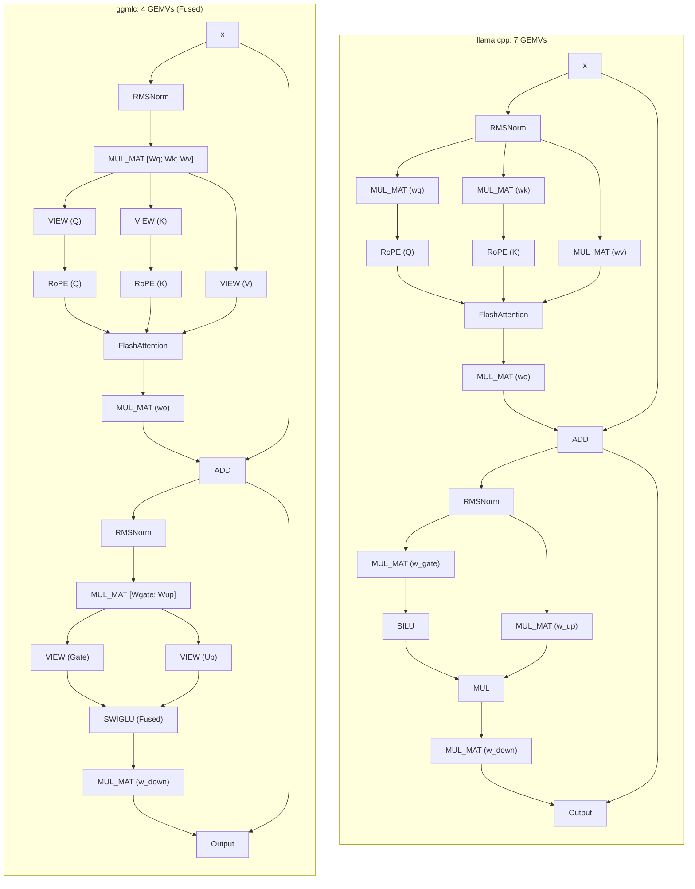

# `ggmlc` vs. `llama.cpp`: Architecture and Performance

Comparing compiler-generated GGML execution graphs (`ggmlc`) against hand-written C++ implementations (`llama.cpp`).

## Summary

- **Approach**: `ggmlc` compiles models directly from PyTorch (`torch.export`) and JAX (`jaxpr`) traces into GGML graphs with automated optimization passes (horizontal fusion, view folding). `llama.cpp` implements models as hand-written C++ classes.
- **Graph structure**: `ggmlc` has ~1.5x–2x more graph nodes because tensor views, slices, and reshapes are explicit `GGML_OP_VIEW` nodes. In GGML, views cost 0 FLOPs and dispatch 0 GPU kernels (host pointer math only).
- **Kernel launches**: Horizontal fusion merges parallel projections ($W_q, W_k, W_v$ and $W_{\text{gate}}, W_{\text{up}}$), cutting GEMV dispatches by 40%–43% (4 vs 7 GEMVs per layer, saving 90 kernel launches per token on 30 layers).
- **Performance parity (RTX 4050 Laptop, CUDA 12.8, Q8_0, 2026-09-19)** — last-token logits gather (`set_logits_last_only`, llama `n_outputs=1`) + `(s, n_kv)` graph buckets (`scratch/compare_ggmlc_vs_llama_report.{md,json}`):
  - **Prefill (all $P \in \{16\ldots1024\}$)**: **31/32** cells ≥ **1.01×** vs `llama.cpp` (Qwen/LLaMA pp512–1024 **1.05×–1.16×**; was ~0.84×–0.90× before logits gather). Sole soft spot: GPT-2 Medium `pp16` **0.92×** (launch noise).
  - **Decode ($S = 1$, tg32/tg64)**: **1.01×–1.37×** across all four models.
  - **E2E (`--e2e` / `-pg`)**: chat-like $N=128$ still **~1.0×–1.3×** (Phase 1b).
- **Extensibility**: Non-standard attention patterns (GQA, QK-norm, sliding window, MLA) compile directly from reference Python code without new C++ runtime kernels.

---

## 1. Architectural Comparison

| Dimension | `ggmlc` | `llama.cpp` |
| :--- | :--- | :--- |
| **Model Ingestion** | Compiles PyTorch (`torch.export`) and JAX (`jaxpr`) traces. | Custom Python conversion scripts (`convert_hf_to_gguf.py`). |
| **Model Implementation** | Zero model C++. Generic runtime executes any valid GGUF graph. | Hand-written C++ class per architecture (`src/models/*.cpp`). |
| **Operator Fusion** | Automated compiler passes (horizontal GEMV, affine view folding, SwiGLU). | Manual weight packing during conversion or bespoke multi-weight tensors. |
| **KV Cache** | Graph-bound tensors: decode + chunked prefill use `ggml_set_rows` into a padded `n_kv` view; one prepared compute graph per `(s_q, n_kv)` pad bucket is stashed/activated (llama `can_reuse` analogue) instead of mutating FA shapes. | External C++ ring buffer (`struct llama_kv_cache`) with `ggml_set_rows` and `n_kv` padded to 256; full graph rebuild when `can_reuse` fails. |
| **CUDA Execution** | GGML built-in CUDA graphs keyed per cgraph (stable inside a pad bucket); multi-batch `CUDAGraphManager` for serve buckets. | GGML CUDA graph (CC $\ge 7.0$) or sequential stream dispatches. |
| **Scope** | Unified compiler for LLMs, SLMs, BERT, Whisper, and vision backbones. | Specialized C++ implementations for LLMs, audio, and multimodal. |

---

## 2. Graph Topologies: Single Decoder Layer

Structural comparison of a single Transformer decoder layer (LLaMA / SmolLM2):



### Operator Mapping

| Block | `llama.cpp` | `ggmlc` | Note |
| :--- | :--- | :--- | :--- |
| **Q/K/V Projections** | 3 `MUL_MAT` | 1 fused `MUL_MAT` + 3 `VIEW` | Horizontal fusion merges parallel weights on dim 0. |
| **RoPE** | `ggml_rope_ext` | `ggml_rope_ext` on Q, K views | Identical kernel. |
| **Self-Attention** | `ggml_flash_attn_ext` | `ggml_flash_attn_ext` | Identical kernel. |
| **Output Projection** | 1 `MUL_MAT` | 1 `MUL_MAT` | Identical. |
| **FFN Gate / Up** | 2 `MUL_MAT` | 1 fused `MUL_MAT` + 2 `VIEW` | Horizontal fusion merges Gate and Up. |
| **Activation** | `SILU` + elementwise `MUL` | Fused `SWIGLU` | Single-pass activation. |
| **FFN Down** | 1 `MUL_MAT` | 1 `MUL_MAT` | Identical. |

### Node Count vs. Kernel Launches

- **Views are zero-cost**: Slicing $[W_q; W_k; W_v]$ creates 3 `GGML_OP_VIEW` nodes. In GGML, views do not launch GPU kernels; they compute host-side pointer offsets in ~10 ns.
- **Fewer GPU dispatches**: `ggmlc` dispatches 4 GEMVs per layer vs. 7 in `llama.cpp`.
- **WDDM queue latency**: On Windows, each kernel launch incurs ~15–20 $\mu$s driver queue latency. Saving 90 launches per token on a 30-layer model saves ~1.5 ms CPU stall time.

---

## 3. Frontend Canonicalization

```
PyTorch export (ATen) \
                       --> Canonical IR --> Optimization passes --> GGML graph
JAX jaxpr (XLA)       /
```

PyTorch and JAX traces normalize into a common Canonical IR (`OpCode.MATMUL`, `OpCode.SDPA`). Bitwise and differential tests verify numerical parity across both frontends on equivalent blocks (MLP, ResNet Residual, LayerNorm).

---

## 4. Attention Variants

| Variant | Models | `llama.cpp` | `ggmlc` |
| :--- | :--- | :--- | :--- |
| **GQA / MQA** | LLaMA 3.2, Qwen 2.5, SmolLM2 | Manual head broadcast logic in C++. | Canonicalized to `OpCode.SDPA(enable_gqa=True)` $\to$ `GGML_OP_FLASH_ATTN_EXT`. |
| **QK Normalization** | Qwen 2.5, Gemma 3 | Custom C++ inserting RMSNorm before RoPE. | Traced automatically; lowered as standard RMSNorm nodes. |
| **Sliding Window (SWA)** | Mistral, Gemma 3 | Custom C++ ring-buffer offset math. | Banded causal mask or FlashAttention window attribute. |
| **Logit Softcapping** | Gemma 2 / 3 | C++ conditional passing `logit_softcap` float. | Extracted from attention attributes to `ggml_flash_attn_ext`. |
| **MLA** | DeepSeek V2 / V3 | Custom C++ (`models/deepseek.cpp`). | Decomposes into standard matrix multiplies and split view projections. |

Non-standard attention variants compile directly from Python reference code without custom C++ runtime logic.

---

## 5. Multi-Backend Support

- **CPU**: Standard `ggml-cpu` microkernels (AVX2, FMA, AVX-512).
- **CUDA**: `CUDAGraphManager` (stream capture across CC $\ge 6.0$) + Driver-VMM virtual page mapping (`cuMemMap`).
- **Other Backends**: Emits standard GGUF files with valid GGML graphs, executable on Metal or Vulkan via the GGML backend API.

---

## 6. Benchmarks (RTX 4050 Laptop, CUDA 12.8)

- **Hardware**: NVIDIA GeForce RTX 4050 Laptop (6 GB GDDR6, 96-bit bus, ~192 GB/s peak).
- **Setup**: Windows 11, CUDA 12.8. Standalone C++ harnesses (`ggmlc-bench.exe` vs. `llama-bench.exe`) via `examples/benchmarks/compare_ggmlc_vs_llama_cpp.py`, 4 threads, `ubatch = 512`, `Q8_0`, 5 reps. `ggmlc-bench` defaults to **last-token logits** (llama `n_outputs=1`); use `--full-logits` only for A/B.
- **Latest run**: `scratch/compare_ggmlc_vs_llama_report.{md,json}` (2026-09-19, Phase 2 logits gather). Absolute tok/s vary with thermal/power; **ratios within a run** are the fair metric.

### Prefill Throughput ($P$ Tokens, `ubatch = 512`) — latest

| Model | $P$ | `ggmlc` (tok/s) | `llama.cpp` (tok/s) | Ratio | Regime |
| :--- | :---: | :---: | :---: | :---: | :--- |
| **smollm2_360m** | 16 | **1,581.7** | 970.8 | **1.63x** | Launch-bound (fusion win) |
| | 64 | **4,561.4** | 3,981.1 | **1.15x** | Launch-bound |
| | 128 | **6,581.4** | 5,377.2 | **1.22x** | Launch-bound |
| | 256 | **8,661.9** | 7,934.2 | **1.09x** | Ahead |
| | 512 | **9,900.0** | 9,233.1 | **1.07x** | Single full chunk |
| | 1024 | **9,939.9** | 9,292.8 | **1.07x** | Multi-chunk |
| **qwen2.5_0.5b** | 16 | **1,599.5** | 1,334.8 | **1.20x** | Launch-bound |
| | 64 | **4,851.9** | 3,967.8 | **1.22x** | Launch-bound |
| | 128 | **6,954.0** | 5,941.1 | **1.17x** | Ahead |
| | 256 | **8,859.4** | 8,049.6 | **1.10x** | Ahead |
| | 512 | **9,689.2** | 8,953.4 | **1.08x** | Ahead (was ~0.89×) |
| | 1024 | **9,772.3** | 8,416.7 | **1.16x** | Multi-chunk (was ~0.89×) |
| **gpt2_medium** | 16 | 1,306.8 | 1,426.5 | **0.92x** | Short-prompt launch noise |
| | 64 | **4,364.4** | 4,301.0 | **1.01x** | Parity |
| | 128 | **6,225.4** | 6,064.2 | **1.03x** | Parity |
| | 256 | **7,781.5** | 7,588.9 | **1.03x** | Parity |
| | 512 | **9,080.3** | 8,612.7 | **1.05x** | Ahead |
| | 1024 | **9,139.1** | 8,896.8 | **1.03x** | Multi-chunk |
| **llama3.2_1b** | 16 | **980.4** | 874.1 | **1.12x** | Launch-bound |
| | 64 | **2,804.2** | 2,689.2 | **1.04x** | Parity |
| | 128 | **3,858.7** | 3,690.1 | **1.05x** | Ahead |
| | 256 | **4,575.1** | 4,282.5 | **1.07x** | Ahead |
| | 512 | **5,138.4** | 4,876.0 | **1.05x** | Ahead (was ~0.87×) |
| | 1024 | **5,700.6** | 5,413.9 | **1.05x** | Multi-chunk (was ~0.90×) |

### Decode Throughput ($S = 1$, Memory Bandwidth Bound) — latest

Single-token decode has arithmetic intensity $\approx 1.0\text{ FLOP/Byte}$. After SET_ROWS + padded `n_kv` + decode buckets, CUDA graphs stay warm inside a pad stride.

| Model | Tokens ($N$) | `ggmlc` (tok/s) | `llama.cpp` (tok/s) | Ratio | Active Bandwidth |
| :--- | :---: | :---: | :---: | :---: | :---: |
| **SmolLM2-360M** | 32 | **160.6** | 134.6 | **1.19x** | 62.1 GB/s |
| | 64 | **157.2** | 129.1 | **1.22x** | 60.8 GB/s |
| **Qwen2.5-0.5B** | 32 | **159.8** | 116.2 | **1.37x** | 84.8 GB/s |
| | 64 | **145.5** | 118.5 | **1.23x** | 77.2 GB/s |
| **GPT-2 Medium** | 32 | **132.7** | 128.0 | **1.04x** | 50.4 GB/s |
| | 64 | **132.1** | 126.9 | **1.04x** | 50.2 GB/s |
| **LLaMA-3.2-1B** | 32 | **93.1** | 87.1 | **1.07x** | 122.9 GB/s |
| | 64 | **90.3** | 89.1 | **1.01x** | 119.3 GB/s |

### Observations

1. **Prefill**: after last-token logits gather, **Qwen/LLaMA close (and exceed) llama.cpp** on pp512/pp1024 — the prior ~0.84×–0.90× gap was full-seq `lm_head`, not fat-FFN MMQ tiles.
2. **Decode ($S = 1$)**: SET_ROWS + pad + buckets keep graphs warm — all four models **at or above** llama.cpp (1.01×–1.37×).
3. **Short GPT-2 `pp16` (0.92×)** is the only cell below parity; treat as WDDM launch variance on a tiny prompt, not a systematic regression.
4. **Internal A/B** (`--full-logits` vs default): Qwen +21%, LLaMA +14%, SmolLM +8% tok/s on pp512 — matches vocab size (152k / 128k / 49k).

### Last-token logits gather (`set_logits_last_only`)

`llama-bench` uses `llama_batch_get_one` → `batch.logits == nullptr` → **only the last token** is marked for output, then `ggml_get_rows` before the last layer / `lm_head`. ggmlc mirrors the `lm_head` half via `ModelExecutor::set_logits_last_only(true)` (view last column of the activation feeding the graph-output `MUL_MAT`). See AGENTS.md §14 / Phase 2 for enable/disable defaults and serving A/B notes.

### End-to-end wall clock (`--e2e` / `-pg`)

User-shaped turns time **prefill then decode in one shot** (`ggmlc-bench -pg` vs `llama-bench -pg`). See `scratch/compare_ggmlc_vs_llama_e2e_summary.md`.

| Chat-like ($N=128$) | vs llama.cpp wall ms |
| :--- | :--- |
| SmolLM2-360M ($P=64…1024$) | **1.20x–1.29x** (ahead) |
| Qwen2.5-0.5B / LLaMA-3.2-1B | **~1.0x–1.1x** on $P\ge256$ (ahead/parity) |

**Go/no-go:** **EMBRACE** — full pp/tg matrix is at or above llama.cpp except GPT-2 `pp16`.

### Fusion A/B (prefill gap hypotheses, 2026-09-19)

Harness: `--fusion-no-horizontal-mlp` / `--fusion-no-horizontal-qkv` + `--gguf-suffix` (never overwrites baseline `*_q8_0.gguf`). Full matrix vs `graph_buckets` baseline; details in `scratch/compare_ggmlc_vs_llama_fusion_ab_summary.md`.

| Variant | Qwen Δ pp512/1024 | LLaMA Δ pp512/1024 | SmolLM/GPT-2 | Adopt? |
| :--- | :---: | :---: | :--- | :--- |
| `no_hmlp` (MLP off, QKV on) | +0.019 | +0.044 | 8 regressions | **No** |
| `no_hqkv` (QKV off, MLP on) | −0.004 | +0.037 | 15 regressions | **No** |
| Qwen bias-split | — | — | — | **Skipped** (HQKV-off did not help Qwen) |

**Keep default fusion ON.** Residual Qwen/LLaMA prefill gap was **not** fixed by unfusing Gate+Up or QKV; it was fixed by last-token logits gather (Phase 2).

---

## 7. Bottleneck Isolation (Decode CUDA Graphs)

Factors were tested one at a time with `ggmlc-bench --diag-mode`, `GGMLC_DISABLE_SET_ROWS`, and `GGMLC_KV_PAD` (`scratch/diag_isolate_bottleneck.py`).

| Hypothesis | Isolation | Verdict |
| :--- | :--- | :--- |
| Host KV / mask copies | `--diag-mode host-only` | **Falsified** (~0.03 ms/tok) |
| Arena extra copies | `--unplanned` | **Falsified** (slower) |
| Missing GGML CUDA graphs | frozen `--diag-mode replay` after `GGML_CUDA_GRAPHS=ON` | **Necessary but not sufficient**: replay hit ~196 tok/s on 360M while live stayed ~140 |
| Per-token KV metadata mutation | live vs replay; `GGMLC_DISABLE_SET_ROWS=1` | **Verified**. `k_slot->view_offs` and `k_active->ne[1]` changed every token, resetting CUDA-graph warmup |
| Inefficient PyTorch→GGML lowering / layout | serialized opcode histogram vs runtime graph; CONT attribution | **Verified for prefill**. Pattern `VIEW(QKV)→RESHAPE→ROPE→PERMUTE→FA` forced **90 CONT** (reshape-of-noncontig-view). Decode was already graph-bound after SET_ROWS. |

### Fix (decode + multi-chunk)

Decode writes K/V with `ggml_set_rows` into the full cache and attends a padded view (`n_kv = max(256, pad(pos+1, 256))`), updating only index/mask *contents*. Chunked prefill uses the same SET_ROWS path. When padded `n_kv` crosses a bucket (e.g. 512→1024), the executor **stashes** the live prepared graph and **activates/rebuilds** a graph for the new `(s_q, n_kv)` — the llama.cpp `can_reuse` / `build_graph` pattern — instead of mutating FA `ne[]` in place. `reset_kv_cache` only zeroes KV buffers; prepared buckets survive across bench reps.

### Fix (prefill layout)

Runtime layout canonicalization:
- `PERMUTE` stays a metadata view **only when every consumer is `FLASH_ATTN_EXT`** (RoPE→FA path). Other consumers (vision CONV/LINEAR) still get CONT.
- Fused-QKV `VIEW([E,S])→RESHAPE([D,H,S])` becomes a **strided view** that preserves the packed QKV outer stride (`try_reshape_strided_view`), so RoPE/FA never pay a CONT copy.
- CUDA unary kernels (`unary.cu`) still require contiguous `src0`: `UNARY` / `SIN` / `COS` / `LOG` / `SQRT` / `SQR` materialize CONT at the consumer (e.g. Gemma3 attention soft-cap `tanh`) without forcing every QKV `VIEW` to CONT.
- A/B: `GGMLC_RESHAPE_FORCE_CONT`, `GGMLC_PERMUTE_FORCE_CONT`, `GGMLC_VIEW_FORCE_CONT`.

### Re-measured decode (`p=0`, `tg32`, 3 reps, RTX 4050)

| Setup | tok/s |
| :--- | ---: |
| SmolLM2-360M SET_ROWS + pad256 (live) | **192.47** |
| SmolLM2-360M frozen replay | **196.45** |
| SmolLM2-360M legacy view+cpy | 140.06 |
| SmolLM2-135M ggmlc | **~302** |
| SmolLM2-135M llama.cpp | 278.98 (**ggmlc ≥1.03x**) |

### Re-measured prefill (`pp512`, `ubatch=512`)

| Setup | CONT | tok/s |
| :--- | ---: | ---: |
| SmolLM2-135M strided reshape | **0** | **16098** |
| SmolLM2-135M legacy FORCE_*_CONT | 240 | 13566.66 |
| SmolLM2-135M llama.cpp | — | 15659.74 (**ggmlc 1.03x**) |
| SmolLM2-360M strided reshape | **0** | **8595** |

Greedy token identity vs the legacy KV path holds (cosine ≥ 0.9988 on 8 decode steps).

### Numerical parity gate (layout change)

`python examples/benchmarks/benchmark_suite.py --backend cuda` across PyTorch / JAX / Flax / Keras / KerasHub families (`scratch/benchmark_cuda_layout_parity*.{md,json}`):

| Family | Result |
| :--- | :--- |
| Vision-CNN / Detection / ViT | PASS (incl. `convnext_tiny`, `ssdlite320_mobilenet_v3`) |
| Text (BERT, MiniLM, BGE, GPT-2, SmolLM2, Qwen2.5) | PASS |
| Audio (Whisper enc/dec) | PASS |
| Multimodal CLIP | PASS |
| Flax ViT + Keras Applications | PASS |
| KerasHub (BERT, DistilBERT, GPT-2, Gemma3) | PASS (Gemma3 required unary CONT for soft-cap) |

---

## 8. Current Gaps

1. **Compiler-level RoPE layout pass**: Runtime strided reshape closes the CONT tax; a Canonical-IR pass that emits `[D,H,S]` views directly (and fuses `ROPE+VIEW+SET_ROWS` like llama.cpp CUDA) would shrink the IR further.
2. **Last-layer gather (optional)**: llama also `ggml_get_rows` before the *last transformer layer* (not only `lm_head`). ggmlc currently gathers only at the graph-output `MUL_MAT`. Worth A/B under continuous batching if last-layer FFN still shows up in profiles.
3. **`set_logits_last_only` under multi-request serving**: defaults and A/B notes in AGENTS.md — concurrent decode ($B>1$) may need per-slot output ids rather than a single last-token view.
4. **Faster first-time rebuild**: bucket hits are cheap; the first `prepare()` per `(s, n_kv)` still walks Canonical IR. A lighter native rebuild (closer to llama `build_graph` cost) remains optional.
5. **Quantization Formats**: Supports `Q8_0`, `Q4_0`, and `F16`. Non-linear k-quants (`Q4_K_M`, `IQ*`) are not yet implemented.
6. **Driver-VMM KV Integration**: Virtual memory paging is implemented in `--serve`, but not yet enabled by default in batch prefill/decode.
7. **CPU Microkernels**: Relies on upstream `ggml-cpu` without custom assembly GEMV kernels.

