# GGMLC vs llama.cpp: Architectural Paradigm, Graph Structure & Performance Comparison

## 1. Executive Summary

This document provides a comprehensive structural, theoretical, and empirical comparison between **`ggmlc`** (a multi-framework neural network compiler that lowers PyTorch, JAX, Flax, and Keras models to portable GGML execution) and **`llama.cpp`** (a specialized C++ inference engine using handcrafted computation graphs).

### Core Questions Addressed:
1. **Extensibility & Complex Attention Mechanisms**: How `ggmlc` handles emerging, complex attention mechanisms (e.g. Gemma 3 sliding window attention with interleaving, dynamic RoPE scaling, Q/K normalization, logit softcapping) compared to `llama.cpp`.
2. **Graph Structure & Topology**: In what fundamental ways graphs generated by `ggmlc` differ from those manually constructed in `llama.cpp`.
3. **Execution-Based Performance**: How automated compiler-level horizontal operator fusion, static planned arena memory reuse, and unified CUDA graph capture translate to real-world latency, throughput, and driver launch savings on CPU and NVIDIA GPU hardware.

---

## 2. Fundamental Architectural Paradigm Comparison

```mermaid
flowchart TD
    subgraph GGMLC["ggmlc: Neural Network Compiler Paradigm"]
        A1["Python Source Models\n(PyTorch torch.export / JAX jaxpr / KerasHub)"] --> A2["Canonical Intermediate Representation (IR)\n- Semantic Tensor Program\n- Framework-Independent DAG"]
        A2 --> A3["Compiler Optimization Pipeline\n- Horizontal GEMV Fusion (Q+K+V, Gate+Up)\n- LayerNorm / RMSNorm Fusion\n- Dead Code Elimination & Layout Canonicalization"]
        A3 --> A4["GGML Dialect Lowering\n- Planned Arena Offset Allocation\n- GGUF Bytecode & Metadata Serialization"]
        A4 --> A5["High-Performance Standalone C++ Runtime\n- Driver-VMM Dynamic Virtual Memory\n- Static CUDA Graph Replay (CC >= 6.0)"]
    end

    subgraph LLAMACPP["llama.cpp: Handcrafted C++ Engine Paradigm"]
        B1["PyTorch / Safetensors Checkpoints"] --> B2["Python GGUF Conversion Scripts\n(convert_hf_to_gguf.py)"]
        B2 --> B3["Handwritten C++ Class per Model\n(llama_model_llama, llama_model_gemma3, etc.)"]
        B3 --> B4["Manual ggml_* C Graph Construction Loop\n(build_norm, build_qkv, build_attn, build_ffn)"]
        B4 --> B5["Runtime Memory Allocator\n(ggml-alloc node lifetime graph traversal)"]
        B5 --> B6["C++ Execution Engine\n- Sequential Stream Kernel Dispatches\n- GGML CUDA Graphs (CC >= 7.0 only)"]
    end
```



| Dimension | `ggmlc` (Compiler Approach) | `llama.cpp` (Manual C++ Engine) |
| :--- | :--- | :--- |
| **Model Ingestion** | Compiles directly from standard PyTorch (`torch.export`), JAX (`jaxpr`), Flax, and Keras 3 Python definitions. | Requires dedicated Python conversion scripts and custom C++ struct/loader implementations per architecture. |
| **New Model & Attention Support** | **Zero C++ code needed**. Any novel attention variant (e.g. Gemma 3 interleaved sliding window + global attention, RoPE scaling factors, Q/K norm, logit softcapping) compiles automatically from the framework's mathematical trace. | **Requires manual C++ coding** in `src/models/*.cpp`, adding enum entries in `llama-arch.h`, and writing GGUF conversion logic for every new architecture. |
| **Operator Fusion** | Automated compiler-level horizontal fusion: merges parallel Q, K, V projections ($[W_q; W_k; W_v]$) and Gate + Up FFN linear layers ($[W_{\text{gate}}; W_{\text{up}}]$), slashing kernel launches by 40–50% per layer. | Relies on manual weight packing during conversion or specialized multi-weight tensors (`wqkv`). |
| **Memory Allocation** | Static Planned Arena Memory Reuse (pre-calculated tensor offsets embedded in metadata) + CUDA Driver-VMM for zero-copy dynamic sequence expansion without device pointer relocation. | Dynamic runtime memory allocator (`ggml-alloc`) calculating tensor buffer lifetimes per forward graph. |
| **CUDA Execution & Driver Overhead** | Unified `CUDAGraphManager` runtime bridge capturing full static decode graphs across **all CC $\ge 6.0$ GPUs** (Pascal GTX 1050 through Blackwell), eliminating Windows WDDM driver launch queues (~15–25 $\mu$s per kernel). | Upstream GGML CUDA graph (limited to CC $\ge 7.0$ with rigid allocation constraints) or sequential stream kernel dispatches. |
| **Cross-Modal Scope** | Unified compiler handles LLMs, SLMs, BERT encoders, Audio Seq2Seq (Whisper), Object Detection (SSDLite), and Vision Backbones (ResNet, ConvNeXt, MobileNetV3, ViT). | Specialized and bifurcated across separate sub-projects (`llama.cpp`, `whisper.cpp`, `mtmd/clip.cpp`, `llava`). |

---

## 3. Structural Graph Analysis across Shared Architectures

### A. Shared Model Matrix
1. **SmolLM2-135M / LLaMA 3.2** (`src/models/llama.cpp`): 30 layers, 9 heads (3 KV heads, GQA), RoPE, RMSNorm, SwiGLU FFN.
2. **Qwen 2.5 0.5B** (`src/models/qwen2.cpp`): 24 layers, 14 heads (2 KV heads, GQA), RoPE with Q/K bias, RMSNorm, SwiGLU.
3. **Gemma 3 270M / 1B** (`src/models/gemma3.cpp`): 18 layers, interleaved sliding window (ISWA) + global attention, Q/K normalization, logit softcapping, unit RMSNorm ($1+w$).
4. **GPT-2 124M** (`src/models/gpt2.cpp`): 12 layers, 12 heads, learned absolute position embeddings, standard LayerNorm with bias, Sequential GELU MLP.
5. **BERT / MiniLM-L6** (`src/models/bert.cpp`): 6–12 layers, bidirectional full attention, token type embeddings, LayerNorm.

### B. Graph Complexity & Operator Reductions

| Architecture | Model | ggmlc Nodes | llama.cpp Nodes | Node Savings | ggmlc GEMV/tok | llama.cpp GEMV/tok | Kernel Launch Reduction |
| :--- | :--- | :---: | :---: | :---: | :---: | :---: | :---: |
| **SmolLM2 / LLaMA** | `smollm2_135m` | 312 | 483 | **-35.4%** | **121** | 211 | **-42.7%** |
| **Qwen 2.5** | `qwen2.5_0.5b` | 268 | 435 | **-38.4%** | **97** | 169 | **-42.6%** |
| **GPT-2** | `gpt2` | 134 | 123 | **-** | **37** | 49 | **-24.5%** |
| **BERT / MiniLM** | `minilm_l6` | 89 | 147 | **-39.5%** | **25** | 73 | **-65.8%** |
| **Gemma 3** | `gemma3_270m` | 242 | 363 | **-33.3%** | **73** | 127 | **-42.5%** |

---

## 4. Empirical Performance & Roofline Insights

### A. The Arithmetic Intensity & Driver Dispatch Bottleneck
- In single-token autoregressive decode ($S=1$), arithmetic intensity is strictly **1.0 FLOP / Byte**. Decode is 100% memory bandwidth-bound.
- On Windows consumer GPUs, each kernel launch incurs a DirectX/WDDM driver queue latency of **15–25 $\mu$s**.
- A 30-layer model with unfused linear layers dispatches **~350 to 450 distinct kernels per token**, creating **8.0 ms of pure host driver latency**.
- `ggmlc` addresses this through two synergistic optimizations:
  1. **Horizontal Operator Fusion:** Reduces linear projections from 7 down to 4 per layer (cutting ~90 kernel dispatches per token).
  2. **Unified CUDA Graph Capture (`CUDAGraphManager`):** Replays the entire forward pass in a single stream launch, achieving **78–79 tok/s on GTX 1050** (vs. 48 tok/s for standard `llama.cpp`).

---

## 5. Google Colab Reproduction Guide

You can run the full comparison benchmark on Google Colab (with free T4 GPU or paid A100 GPU) using the following commands:

```bash
# 1. Clone repository and install uv package manager
!git clone https://github.com/monatis/ggmlc.git
%cd ggmlc
!pip install uv
!uv pip install -e .[test] torch torchvision transformers ninja

# 2. Build CUDA runtime extension (Linux / Colab)
!cmake -B build -G Ninja -DGGMLC_ENABLE_CUDA=ON -DCMAKE_BUILD_TYPE=Release
!cmake --build build -j8

# 3. Run GGMLC vs llama.cpp Comparison Suite on GPU
!python examples/benchmarks/benchmark_llama_cpp_comparison.py --backend cuda --runs 5 --warmup 2 \
  --output-md colab_llamacpp_comparison.md --output-json colab_llamacpp_comparison.json

# 4. Display generated markdown report
from IPython.display import Markdown, display
display(Markdown(open("colab_llamacpp_comparison.md").read()))
```
