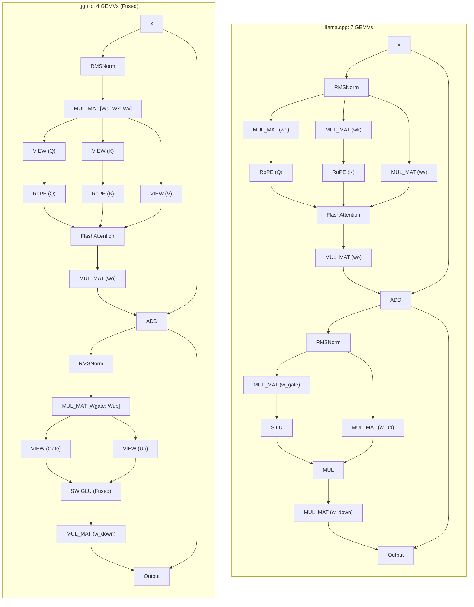

# `ggmlc` vs. `llama.cpp`: Architecture and Performance

Comparing compiler-generated GGML execution graphs (`ggmlc`) against hand-written C++ implementations (`llama.cpp`).

## Summary

- **Approach**: `ggmlc` compiles models directly from PyTorch (`torch.export`) and JAX (`jaxpr`) traces into GGML graphs with automated optimization passes (horizontal fusion, view folding). `llama.cpp` implements models as hand-written C++ classes.
- **Graph structure**: `ggmlc` has ~1.5x–2x more graph nodes because tensor views, slices, and reshapes are explicit `GGML_OP_VIEW` nodes. In GGML, views cost 0 FLOPs and dispatch 0 GPU kernels (host pointer math only).
- **Kernel launches**: Horizontal fusion merges parallel projections ($W_q, W_k, W_v$ and $W_{\text{gate}}, W_{\text{up}}$), cutting GEMV dispatches by 40%–43% (4 vs 7 GEMVs per layer, saving 90 kernel launches per token on 30 layers).
- **Performance parity (RTX 4050 Laptop, CUDA 12.8, Q8_0)** — post SET_ROWS + strided-reshape layout fix (`scratch/compare_ggmlc_vs_llama_post_layout_summary.md`):
  - **Short prefill ($P \le 128$)**: `ggmlc` is **1.01x–1.18x** vs `llama.cpp` (fusion / launch-bound win).
  - **Single chunk ($P = 512$)**: **~0.88x–1.01x** (SmolLM2-360M **1.01x** after CONT elimination + chunk SET_ROWS).
  - **Multi-chunk ($P = 1024$, ubatch 512)**: **~0.76x–0.86x** after SET_ROWS (was view+cpy); remaining gap is FA `n_kv` growth 512→1024 forcing CUDA-graph reshape on chunk 2.
  - **Decode ($S = 1$)**: **~0.99x–1.11x** — SmolLM2 / Qwen / LLaMA at or above llama.cpp.
- **Extensibility**: Non-standard attention patterns (GQA, QK-norm, sliding window, MLA) compile directly from reference Python code without new C++ runtime kernels.

---

## 1. Architectural Comparison

| Dimension | `ggmlc` | `llama.cpp` |
| :--- | :--- | :--- |
| **Model Ingestion** | Compiles PyTorch (`torch.export`) and JAX (`jaxpr`) traces. | Custom Python conversion scripts (`convert_hf_to_gguf.py`). |
| **Model Implementation** | Zero model C++. Generic runtime executes any valid GGUF graph. | Hand-written C++ class per architecture (`src/models/*.cpp`). |
| **Operator Fusion** | Automated compiler passes (horizontal GEMV, affine view folding, SwiGLU). | Manual weight packing during conversion or bespoke multi-weight tensors. |
| **KV Cache** | Graph-bound tensors: decode + chunked prefill use `ggml_set_rows` into a padded `n_kv` view; `set_chunk_pos` grows active length in-place (no CPY). | External C++ ring buffer (`struct llama_kv_cache`) with `ggml_set_rows` and `n_kv` padded to 256. |
| **CUDA Execution** | `CUDAGraphManager` (stream capture across CC $\ge 6.0$) + generic graph compute. | GGML CUDA graph (CC $\ge 7.0$) or sequential stream dispatches. |
| **Scope** | Unified compiler for LLMs, SLMs, BERT, Whisper, and vision backbones. | Specialized C++ implementations for LLMs, audio, and multimodal. |

---

## 2. Graph Topologies: Single Decoder Layer

Structural comparison of a single Transformer decoder layer (LLaMA / SmolLM2):



### Operator Mapping

| Block | `llama.cpp` | `ggmlc` | Note |
| :--- | :--- | :--- | :--- |
| **Q/K/V Projections** | 3 `MUL_MAT` | 1 fused `MUL_MAT` + 3 `VIEW` | Horizontal fusion merges parallel weights on dim 0. |
| **RoPE** | `ggml_rope_ext` | `ggml_rope_ext` on Q, K views | Identical kernel. |
| **Self-Attention** | `ggml_flash_attn_ext` | `ggml_flash_attn_ext` | Identical kernel. |
| **Output Projection** | 1 `MUL_MAT` | 1 `MUL_MAT` | Identical. |
| **FFN Gate / Up** | 2 `MUL_MAT` | 1 fused `MUL_MAT` + 2 `VIEW` | Horizontal fusion merges Gate and Up. |
| **Activation** | `SILU` + elementwise `MUL` | Fused `SWIGLU` | Single-pass activation. |
| **FFN Down** | 1 `MUL_MAT` | 1 `MUL_MAT` | Identical. |

### Node Count vs. Kernel Launches

- **Views are zero-cost**: Slicing $[W_q; W_k; W_v]$ creates 3 `GGML_OP_VIEW` nodes. In GGML, views do not launch GPU kernels; they compute host-side pointer offsets in ~10 ns.
- **Fewer GPU dispatches**: `ggmlc` dispatches 4 GEMVs per layer vs. 7 in `llama.cpp`.
- **WDDM queue latency**: On Windows, each kernel launch incurs ~15–20 $\mu$s driver queue latency. Saving 90 launches per token on a 30-layer model saves ~1.5 ms CPU stall time.

---

## 3. Frontend Canonicalization

```
PyTorch export (ATen) \
                       --> Canonical IR --> Optimization passes --> GGML graph
JAX jaxpr (XLA)       /
```

PyTorch and JAX traces normalize into a common Canonical IR (`OpCode.MATMUL`, `OpCode.SDPA`). Bitwise and differential tests verify numerical parity across both frontends on equivalent blocks (MLP, ResNet Residual, LayerNorm).

---

## 4. Attention Variants

| Variant | Models | `llama.cpp` | `ggmlc` |
| :--- | :--- | :--- | :--- |
| **GQA / MQA** | LLaMA 3.2, Qwen 2.5, SmolLM2 | Manual head broadcast logic in C++. | Canonicalized to `OpCode.SDPA(enable_gqa=True)` $\to$ `GGML_OP_FLASH_ATTN_EXT`. |
| **QK Normalization** | Qwen 2.5, Gemma 3 | Custom C++ inserting RMSNorm before RoPE. | Traced automatically; lowered as standard RMSNorm nodes. |
| **Sliding Window (SWA)** | Mistral, Gemma 3 | Custom C++ ring-buffer offset math. | Banded causal mask or FlashAttention window attribute. |
| **Logit Softcapping** | Gemma 2 / 3 | C++ conditional passing `logit_softcap` float. | Extracted from attention attributes to `ggml_flash_attn_ext`. |
| **MLA** | DeepSeek V2 / V3 | Custom C++ (`models/deepseek.cpp`). | Decomposes into standard matrix multiplies and split view projections. |

Non-standard attention variants compile directly from Python reference code without custom C++ runtime logic.

---

## 5. Multi-Backend Support

- **CPU**: Standard `ggml-cpu` microkernels (AVX2, FMA, AVX-512).
- **CUDA**: `CUDAGraphManager` (stream capture across CC $\ge 6.0$) + Driver-VMM virtual page mapping (`cuMemMap`).
- **Other Backends**: Emits standard GGUF files with valid GGML graphs, executable on Metal or Vulkan via the GGML backend API.

---

## 6. Benchmarks (RTX 4050 Laptop, CUDA 12.8)

- **Hardware**: NVIDIA GeForce RTX 4050 Laptop (6 GB GDDR6, 96-bit bus, ~192 GB/s peak).
- **Setup**: Windows 11, CUDA 12.8. Standalone C++ harnesses (`ggmlc-bench.exe` vs. `llama-bench.exe`) via `examples/benchmarks/compare_ggmlc_vs_llama_cpp.py`, 4 threads, `ubatch = 512`, `Q8_0`, 5 reps.
- **Latest run**: `scratch/compare_ggmlc_vs_llama_chunk_set_rows.{md,json}` + delta vs prior `scratch/compare_ggmlc_vs_llama_chunk_set_rows_summary.{md,json}` (chunk SET_ROWS). Absolute tok/s vary with thermal/power; **ratios within a run** are the fair metric.

### Prefill Throughput ($P$ Tokens, `ubatch = 512`) — latest

| Model | $P$ | `ggmlc` (tok/s) | `llama.cpp` (tok/s) | Ratio | Regime |
| :--- | :---: | :---: | :---: | :---: | :--- |
| **smollm2_360m** | 16 | **1,946.4** | 1,651.4 | **1.18x** | Launch-bound (fusion win) |
| | 64 | **5,281.2** | 4,510.4 | **1.17x** | Launch-bound |
| | 128 | **6,812.5** | 6,417.9 | **1.06x** | Launch-bound |
| | 256 | **8,306.0** | 8,198.5 | **1.01x** | Parity |
| | 512 | 8,930.8 | 9,321.8 | **0.96x** | Single full chunk (near parity) |
| | 1024 | 7,731.0 | 9,136.8 | **0.85x** | Multi-chunk |
| **qwen2.5_0.5b** | 16 | **1,752.9** | 1,656.4 | **1.06x** | Launch-bound |
| | 64 | **4,678.5** | 4,485.0 | **1.04x** | Parity |
| | 128 | 6,230.6 | 6,268.5 | **0.99x** | Parity |
| | 256 | 7,392.7 | 8,187.7 | **0.90x** | Compute-bound |
| | 512 | 8,014.9 | 9,089.6 | **0.88x** | Compute-bound |
| | 1024 | 6,565.1 | 9,207.0 | **0.71x** | Multi-chunk |
| **gpt2_medium** | 16 | **2,064.8** | 1,902.0 | **1.09x** | Launch-bound |
| | 64 | **5,196.1** | 5,124.8 | **1.01x** | Parity |
| | 128 | 6,621.5 | 6,961.9 | **0.95x** | Parity |
| | 256 | 7,846.3 | 8,752.4 | **0.90x** | Compute-bound |
| | 512 | 8,758.9 | 9,413.4 | **0.93x** | Near parity |
| | 1024 | 7,751.7 | 9,117.3 | **0.85x** | Multi-chunk |
| **llama3.2_1b** | 16 | **1,126.0** | 1,069.7 | **1.05x** | Launch-bound |
| | 64 | 3,012.2 | 3,027.3 | **0.99x** | Parity |
| | 128 | 3,757.8 | 4,071.2 | **0.92x** | Near parity |
| | 256 | 4,169.4 | 4,679.0 | **0.89x** | Compute-bound |
| | 512 | 4,534.5 | 5,248.7 | **0.86x** | Compute-bound |
| | 1024 | 4,355.1 | 5,495.5 | **0.79x** | Multi-chunk |

### Decode Throughput ($S = 1$, Memory Bandwidth Bound) — latest

Single-token decode has arithmetic intensity $\approx 1.0\text{ FLOP/Byte}$. After SET_ROWS + padded `n_kv`, decode CUDA graphs stay warm.

| Model | Tokens ($N$) | `ggmlc` (tok/s) | `llama.cpp` (tok/s) | Ratio | Active Bandwidth |
| :--- | :---: | :---: | :---: | :---: | :---: |
| **SmolLM2-360M** | 128 | **216.8** | 195.3 | **1.11x** | 83.8 GB/s |
| | 32 | **205.4** | 199.0 | **1.03x** | 79.4 GB/s |
| **Qwen2.5-0.5B** | 128 | **199.2** | 187.8 | **1.06x** | 105.7 GB/s |
| | 32 | **189.3** | 183.7 | **1.03x** | 100.5 GB/s |
| **GPT-2 Medium** | 128 | 185.2 | 191.5 | **0.97x** | 70.4 GB/s |
| | 32 | 174.4 | 188.8 | **0.92x** | 66.2 GB/s |
| **LLaMA-3.2-1B** | 128 | **111.4** | 110.1 | **1.01x** | 147.1 GB/s |
| | 32 | 99.7 | 104.9 | **0.95x** | 131.7 GB/s |

### Observations

1. **Short prefill ($P \le 128$)**: still ahead or at parity vs `llama.cpp` from horizontal fusion (fewer WDDM launches).
2. **Single full chunk ($P = 512$)**: SmolLM2 near parity (**0.96x**) after fused-QKV CONT elimination; other models 0.86x–0.93x.
3. **Multi-chunk prefill ($P = 1024$)**: still the main remaining gap (0.71x–0.85x); chunk cache mutates KV views so CUDA graphs cannot stay warm across chunks.
4. **Decode ($S = 1$)**: SET_ROWS + pad flipped the prior 0.78x–0.91x deficit — SmolLM2 / Qwen now **beat** llama.cpp; LLaMA ~parity.

---

## 7. Bottleneck Isolation (Decode CUDA Graphs)

Factors were tested one at a time with `ggmlc-bench --diag-mode`, `GGMLC_DISABLE_SET_ROWS`, and `GGMLC_KV_PAD` (`scratch/diag_isolate_bottleneck.py`).

| Hypothesis | Isolation | Verdict |
| :--- | :--- | :--- |
| Host KV / mask copies | `--diag-mode host-only` | **Falsified** (~0.03 ms/tok) |
| Arena extra copies | `--unplanned` | **Falsified** (slower) |
| Missing GGML CUDA graphs | frozen `--diag-mode replay` after `GGML_CUDA_GRAPHS=ON` | **Necessary but not sufficient**: replay hit ~196 tok/s on 360M while live stayed ~140 |
| Per-token KV metadata mutation | live vs replay; `GGMLC_DISABLE_SET_ROWS=1` | **Verified**. `k_slot->view_offs` and `k_active->ne[1]` changed every token, resetting CUDA-graph warmup |
| Inefficient PyTorch→GGML lowering / layout | serialized opcode histogram vs runtime graph; CONT attribution | **Verified for prefill**. Pattern `VIEW(QKV)→RESHAPE→ROPE→PERMUTE→FA` forced **90 CONT** (reshape-of-noncontig-view). Decode was already graph-bound after SET_ROWS. |

### Fix (decode)

Decode writes K/V with `ggml_set_rows` into the full cache and attends a padded view (`n_kv = max(256, pad(pos+1, 256))`), updating only index/mask *contents*. Chunked prefill (`s_q > 1`) uses the same SET_ROWS path; `set_chunk_pos` updates row indices and grows `k_active`/`mask` to the new padded `n_kv` without VIEW+CPY (CUDA graphs still reshape when crossing a pad bucket, e.g. 512→1024).

### Fix (prefill layout)

Runtime layout canonicalization:
- `PERMUTE` stays a metadata view **only when every consumer is `FLASH_ATTN_EXT`** (RoPE→FA path). Other consumers (vision CONV/LINEAR) still get CONT.
- Fused-QKV `VIEW([E,S])→RESHAPE([D,H,S])` becomes a **strided view** that preserves the packed QKV outer stride (`try_reshape_strided_view`), so RoPE/FA never pay a CONT copy.
- CUDA unary kernels (`unary.cu`) still require contiguous `src0`: `UNARY` / `SIN` / `COS` / `LOG` / `SQRT` / `SQR` materialize CONT at the consumer (e.g. Gemma3 attention soft-cap `tanh`) without forcing every QKV `VIEW` to CONT.
- A/B: `GGMLC_RESHAPE_FORCE_CONT`, `GGMLC_PERMUTE_FORCE_CONT`, `GGMLC_VIEW_FORCE_CONT`.

### Re-measured decode (`p=0`, `tg32`, 3 reps, RTX 4050)

| Setup | tok/s |
| :--- | ---: |
| SmolLM2-360M SET_ROWS + pad256 (live) | **192.47** |
| SmolLM2-360M frozen replay | **196.45** |
| SmolLM2-360M legacy view+cpy | 140.06 |
| SmolLM2-135M ggmlc | **~302** |
| SmolLM2-135M llama.cpp | 278.98 (**ggmlc ≥1.03x**) |

### Re-measured prefill (`pp512`, `ubatch=512`)

| Setup | CONT | tok/s |
| :--- | ---: | ---: |
| SmolLM2-135M strided reshape | **0** | **16098** |
| SmolLM2-135M legacy FORCE_*_CONT | 240 | 13566.66 |
| SmolLM2-135M llama.cpp | — | 15659.74 (**ggmlc 1.03x**) |
| SmolLM2-360M strided reshape | **0** | **8595** |

Greedy token identity vs the legacy KV path holds (cosine ≥ 0.9988 on 8 decode steps).

### Numerical parity gate (layout change)

`python examples/benchmarks/benchmark_suite.py --backend cuda` across PyTorch / JAX / Flax / Keras / KerasHub families (`scratch/benchmark_cuda_layout_parity*.{md,json}`):

| Family | Result |
| :--- | :--- |
| Vision-CNN / Detection / ViT | PASS (incl. `convnext_tiny`, `ssdlite320_mobilenet_v3`) |
| Text (BERT, MiniLM, BGE, GPT-2, SmolLM2, Qwen2.5) | PASS |
| Audio (Whisper enc/dec) | PASS |
| Multimodal CLIP | PASS |
| Flax ViT + Keras Applications | PASS |
| KerasHub (BERT, DistilBERT, GPT-2, Gemma3) | PASS (Gemma3 required unary CONT for soft-cap) |

---

## 8. Current Gaps

1. **Compiler-level RoPE layout pass**: Runtime strided reshape closes the CONT tax; a Canonical-IR pass that emits `[D,H,S]` views directly (and fuses `ROPE+VIEW+SET_ROWS` like llama.cpp CUDA) would shrink the IR further.
2. **Multi-chunk prefill FA pad buckets**: SET_ROWS removed CPY, but `n_kv` 512→1024 still changes FA shapes. Options: over-pad first chunk to `2*ubatch` (hurts pp512) or CUDA-graph update without full reshape.
3. **Quantization Formats**: Supports `Q8_0`, `Q4_0`, and `F16`. Non-linear k-quants (`Q4_K_M`, `IQ*`) are not yet implemented.
4. **Driver-VMM KV Integration**: Virtual memory paging is implemented in `--serve`, but not yet enabled by default in batch prefill/decode.
5. **CPU Microkernels**: Relies on upstream `ggml-cpu` without custom assembly GEMV kernels.

