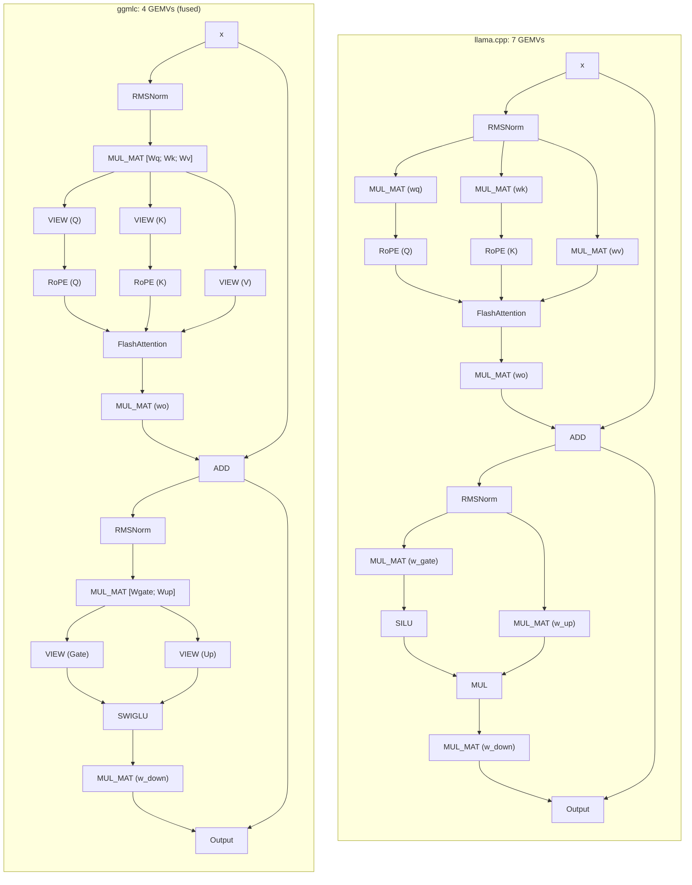

# `ggmlc` vs. `llama.cpp`: Architecture and Performance

Comparison of compiler-generated GGML graphs (`ggmlc`) against hand-written `llama.cpp` model implementations on the same hardware and quantization.

## 1. Architecture

| Dimension | `ggmlc` | `llama.cpp` |
| :--- | :--- | :--- |
| Model ingestion | Compiles PyTorch (`torch.export`) and JAX (`jaxpr`) traces. | HF → GGUF conversion scripts (`convert_hf_to_gguf.py`). |
| Model code | No per-architecture C++. Generic runtime executes the serialized graph. | Hand-written C++ per architecture (`src/models/*.cpp`). |
| Fusion | Compiler passes: horizontal GEMV (QKV, Gate+Up), affine view folding, fused SwiGLU. | Weight packing at conversion and/or bespoke multi-weight tensors. |
| KV cache | Graph-bound tensors; decode and chunked prefill write with `ggml_set_rows` into a padded `n_kv` view. One prepared compute graph per `(s_q, n_kv)` pad bucket is stashed/activated (same role as llama `can_reuse`). | External ring buffer (`llama_kv_cache`) with `ggml_set_rows` and `n_kv` padded to 256; rebuild when `can_reuse` fails. |
| CUDA | GGML CUDA graphs keyed per cgraph inside a pad bucket; `CUDAGraphManager` for multi-batch serve buckets. | GGML CUDA graphs (CC ≥ 7.0) or sequential launches. |
| Output logits (prefill / sampling) | `ModelExecutor::set_logits_last_only`: last activation column only for the graph-output `MUL_MAT` (`lm_head` / tied embed). Default on in `ggmlc-bench`, `ggmlc-run`, and `ContinuousBatchScheduler`. Off on a bare `ModelExecutor` (full-seq logits for numerical tests). Disable in bench with `--full-logits`. | `llama_batch_get_one` leaves `logits == nullptr` → only the last token is an output (`n_outputs=1`); `ggml_get_rows` before the last layer and `lm_head`. |

### Decoder layer (LLaMA / SmolLM2 family)



| Block | `llama.cpp` | `ggmlc` |
| :--- | :--- | :--- |
| Q/K/V | 3× `MUL_MAT` | 1× fused `MUL_MAT` + 3× `VIEW` |
| RoPE / FA / O / FFN down | Same GGML ops | Same GGML ops |
| Gate / Up | 2× `MUL_MAT` | 1× fused `MUL_MAT` + 2× `VIEW` |
| Activation | `SILU` + `MUL` | `SWIGLU` |

`GGML_OP_VIEW` does not launch device kernels. ggmlc therefore issues 4 weight GEMVs per layer versus 7 in the unfused llama layout. Official HF/llama GGUFs keep separate `gate_proj`/`up_proj` (and Q/K/V); fusion in ggmlc is compile-time only.

### Layout (runtime)

- Fused-QKV `VIEW → RESHAPE` uses a strided view so RoPE / FlashAttention do not insert `CONT` on that path.
- `PERMUTE` stays metadata when every consumer is `FLASH_ATTN_EXT`; other consumers may still require `CONT`.
- CUDA unary kernels require contiguous `src0`; unary ops materialize `CONT` at the consumer when needed.
- Prefill graphs used in the matrix below report `n_cont_or_dup = 0` and `n_cpy = 0`.

### Attention variants

| Variant | `llama.cpp` | `ggmlc` |
| :--- | :--- | :--- |
| GQA / MQA | Hand-written head broadcast in C++ | `OpCode.SDPA(enable_gqa=True)` → `FLASH_ATTN_EXT` |
| QK-Norm | Inserted in model C++ | Traced RMSNorm nodes |
| Sliding window | Ring-buffer offsets in C++ | Mask / FA window attribute |
| Logit softcap | Parameter on FA call | Attribute → `ggml_flash_attn_ext` |

---

## 2. Benchmark setup

| Item | Value |
| :--- | :--- |
| GPU | NVIDIA GeForce RTX 4050 Laptop (6 GB, ~192 GB/s peak) |
| Host | Windows 11, CUDA 12.8 |
| Harness | `ggmlc-bench` vs `llama-bench` via `examples/benchmarks/compare_ggmlc_vs_llama_cpp.py` |
| Quant | Q8_0 |
| Threads | 4 |
| Prefill chunk | `ubatch = 512` |
| Reps | 5 |
| ggmlc logits | Last-token only (default; matches `llama-bench` `n_outputs=1`) |
| llama CUDA graphs | Disabled on WDDM (`GGML_CUDA_DISABLE_GRAPHS=1`) unless overridden |

Absolute tok/s move with thermal/power state. Ratios within a paired run are the comparison metric.

Reproduce:

```bash
python examples/benchmarks/compare_ggmlc_vs_llama_cpp.py --backend cuda --cuda-graph --ubatch 512 --runs 5 --skip-numerical-check
```

---

## 3. Prefill ($P$ tokens)

| Model | $P$ | `ggmlc` (tok/s) | `llama.cpp` (tok/s) | Ratio |
| :--- | :---: | :---: | :---: | :---: |
| **smollm2_360m** | 16 | 1581.7 | 970.8 | 1.63× |
| | 64 | 4561.4 | 3981.1 | 1.15× |
| | 128 | 6581.4 | 5377.2 | 1.22× |
| | 256 | 8661.9 | 7934.2 | 1.09× |
| | 512 | 9900.0 | 9233.1 | 1.07× |
| | 1024 | 9939.9 | 9292.8 | 1.07× |
| **qwen2.5_0.5b** | 16 | 1599.5 | 1334.8 | 1.20× |
| | 64 | 4851.9 | 3967.8 | 1.22× |
| | 128 | 6954.0 | 5941.1 | 1.17× |
| | 256 | 8859.4 | 8049.6 | 1.10× |
| | 512 | 9689.2 | 8953.4 | 1.08× |
| | 1024 | 9772.3 | 8416.7 | 1.16× |
| **gpt2_medium** | 16 | 1306.8 | 1426.5 | 0.92× |
| | 64 | 4364.4 | 4301.0 | 1.01× |
| | 128 | 6225.4 | 6064.2 | 1.03× |
| | 256 | 7781.5 | 7588.9 | 1.03× |
| | 512 | 9080.3 | 8612.7 | 1.05× |
| | 1024 | 9139.1 | 8896.8 | 1.03× |
| **llama3.2_1b** | 16 | 980.4 | 874.1 | 1.12× |
| | 64 | 2804.2 | 2689.2 | 1.04× |
| | 128 | 3858.7 | 3690.1 | 1.05× |
| | 256 | 4575.1 | 4282.5 | 1.07× |
| | 512 | 5138.4 | 4876.0 | 1.05× |
| | 1024 | 5700.6 | 5413.9 | 1.05× |

---

## 4. Decode ($S = 1$)

Arithmetic intensity ≈ 1.0 FLOP/byte (weight streaming). Bandwidth below is `model_bytes × tok/s`.

| Model | $N$ | `ggmlc` (tok/s) | `llama.cpp` (tok/s) | Ratio | Bandwidth |
| :--- | :---: | :---: | :---: | :---: | :---: |
| **smollm2_360m** | 32 | 160.6 | 134.6 | 1.19× | 62.1 GB/s |
| | 64 | 157.2 | 129.1 | 1.22× | 60.8 GB/s |
| **qwen2.5_0.5b** | 32 | 159.8 | 116.2 | 1.37× | 84.8 GB/s |
| | 64 | 145.5 | 118.5 | 1.23× | 77.2 GB/s |
| **gpt2_medium** | 32 | 132.7 | 128.0 | 1.04× | 50.4 GB/s |
| | 64 | 132.1 | 126.9 | 1.04× | 50.2 GB/s |
| **llama3.2_1b** | 32 | 93.1 | 87.1 | 1.07× | 122.9 GB/s |
| | 64 | 90.3 | 89.1 | 1.01× | 119.3 GB/s |

---

## 5. End-to-end wall clock (`-pg`)

One timed shot: prefill $P$ then decode $N$ (`ggmlc-bench -pg` / `llama-bench -pg`).

```bash
python examples/benchmarks/compare_ggmlc_vs_llama_cpp.py --backend cuda --cuda-graph --e2e --skip-numerical-check
```

| Shape | ggmlc / llama (wall time ratio) |
| :--- | :--- |
| SmolLM2-360M, $N=128$, $P \in [64,1024]$ | ~1.20×–1.29× (ggmlc lower wall time) |
| Qwen2.5-0.5B / LLaMA-3.2-1B, $N=128$, $P \ge 256$ | ~1.0×–1.1× |

---

## 6. Logits contract (apples-to-apples)

Both benches sample from a single final token’s logits after prefill:

- **llama**: `n_outputs = 1`; gather before last layer + `lm_head`.
- **ggmlc**: gather at graph-output `MUL_MAT` only (`set_logits_last_only`). Full-sequence `lm_head` (`V × P` F32 write) is not used in the default bench path.

With `--full-logits` on `ggmlc-bench`, pp512 on the same machine drops relative to the default (larger drop on high-vocab models: Qwen V≈152k, LLaMA V≈128k, SmolLM V≈49k). That mode is for A/B only; it is not the fair `llama-bench` comparison.

Horizontal fusion on/off (`--fusion-no-horizontal-mlp` / `--fusion-no-horizontal-qkv`) does not close a fair-compare gap against llama when logits already match; default fusion remains on.

---

## 7. Gaps and limitations

1. **gpt2_medium pp16 (0.92×)**: only matrix cell below 1.0×. Short-prompt / WDDM launch dominated; not reproduced at $P \ge 64$.
2. **Last-layer gather**: llama can shrink the last transformer layer to `n_outputs` tokens; ggmlc still runs the last layer at full $P$ and only slices into `lm_head`.
3. **Multi-request outputs**: `set_logits_last_only` is a single last-column view. Concurrent prefill / batch decode that needs logits for every slot needs per-request output indices (llama `out_ids`), not only this flag.
4. **First `(s_q, n_kv)` prepare**: bucket reuse is cheap after the first build; the initial `prepare()` still walks the full IR for that shape.
5. **Quantization**: Q8_0, Q4_0, F16. No k-quants / IQ* yet.
6. **Paged KV**: Driver-VMM paging is available under `--serve`; not the default for the pp/tg matrix above.
7. **CPU**: upstream `ggml-cpu` only; no custom assembly GEMV path beyond what GGML provides.
