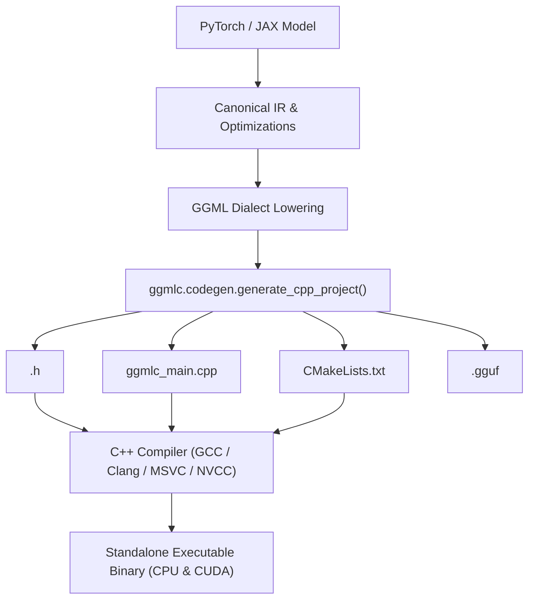

# Standalone C++ Code Generation in `ggmlc`

`ggmlc` provides an Ahead-Of-Time (AOT) **C++ Code Generator** (`ggmlc.codegen`) that compiles any PyTorch or JAX neural network graph into human-readable, self-contained C++ source code supporting both **CPU** and **NVIDIA CUDA GPU** execution.

This enables deploying neural network models as standalone C++ binaries or embedding them directly into native applications (C/C++, iOS, Android, WASM, embedded devices, CUDA clusters) without requiring Python or generic runtime interpreters.

---

## 1. Overview & Architecture

When invoking `generate_cpp_project`, `ggmlc` performs:
1. Canonical IR translation and optimization pass execution.
2. Dialect lowering to GGML semantics.
3. Serialization of model parameters to a standard **GGUF v3** binary container.
4. Emission of a standalone C++ project directory:

```
<output_dir>/
├── <ModelName>.h        # Model definition, GGUF weight loader, and dual CPU/CUDA build_graph()
├── ggmlc_main.cpp       # CLI runner entry point with backend device management
└── CMakeLists.txt       # Build system linking GGML, CUDA (optional), and Threads
```



---

## 2. Generated Code Structure

### A. Model Header (`<ModelName>.h`)
The generated header defines:
- **`struct <ModelName>::Weights`**: Typed `struct ggml_tensor*` pointers for every model parameter.
- **`Weights::load(ggml_context* ctx, gguf_context* gguf_ctx)`**: Creates tensor descriptors from GGUF metadata.
- **`build_graph(ggml_context* ctx, const Weights& weights, ...)`**: Constructs the computational DAG using `ggml_mul_mat`, `ggml_add`, `ggml_reshape_4d`, `ggml_permute`, and dual-backend custom fused ops (emitting native GPU operations under `#if defined(GGML_USE_CUDA)` and OpenMP multi-threaded kernels on CPU).

#### Example Generated Header Snippet
```cpp
#pragma once
#include <unordered_map>
#include <string>
#include "ggml.h"
#include "ggml-alloc.h"
#include "ggml-backend.h"
#include "ggml-cpu.h"
#if defined(GGML_USE_CUDA)
#include "ggml-cuda.h"
#endif
#include "gguf.h"

namespace SimpleMLP {

struct Weights {
    struct ggml_tensor* fc1_weight = nullptr;
    struct ggml_tensor* fc1_bias = nullptr;
    
    void load(struct ggml_context* ctx, struct gguf_context* gguf_ctx) {
        int64_t tid = gguf_find_tensor(gguf_ctx, "fc1.weight");
        if (tid >= 0) {
            this->fc1_weight = ggml_new_tensor_4d(ctx, GGML_TYPE_F32, 64, 32, 1, 1);
            ggml_set_name(this->fc1_weight, "fc1.weight");
        }
    }
};

inline struct ggml_cgraph* build_graph(
    struct ggml_context* ctx,
    const Weights& weights,
    const std::unordered_map<std::string, struct ggml_tensor*>& inputs,
    const std::unordered_map<std::string, int64_t>& symbols = {}
) {
    struct ggml_cgraph* gf = ggml_new_graph(ctx);
    std::unordered_map<uint32_t, struct ggml_tensor*> tensors;

    tensors[0] = weights.fc1_weight;
    tensors[1] = inputs.at("input");

    // Forward computation
    tensors[2] = ggml_mul_mat(ctx, tensors[0], tensors[1]);
    #if defined(GGML_USE_CUDA)
    tensors[3] = ggml_gelu(ctx, ggml_add(ctx, tensors[2], weights.fc1_bias));
    #else
    tensors[3] = ggml_map_custom2(ctx, tensors[2], weights.fc1_bias, ggmlc_compute_forward_bias_gelu, GGML_N_TASKS_MAX, nullptr);
    #endif

    ggml_build_forward_expand(gf, tensors[3]);
    return gf;
}

} // namespace SimpleMLP
```

---

### B. Standalone Backend Runner (`ggmlc_main.cpp`)
The generated runner provides a self-contained execution binary:
- Parses `--device [cpu|cuda|auto]` and `--threads [N]`.
- Initializes the target execution backend (`ggml_backend_cuda_init` or `ggml_backend_cpu_init`).
- Allocates memory on the target hardware via `ggml_backend_alloc_ctx_tensors`.
- Reads inputs, streams them via `ggml_backend_tensor_set`, and computes the graph via `ggml_backend_graph_compute`.

---

### C. Build Configuration (`CMakeLists.txt`)
A minimal CMake project with toggleable GPU acceleration:
```cmake
cmake_minimum_required(VERSION 3.14)
project(SimpleMLP_standalone LANGUAGES C CXX)

set(CMAKE_CXX_STANDARD 17)
set(CMAKE_CXX_STANDARD_REQUIRED ON)

option(ENABLE_CUDA "Enable GGML CUDA GPU backend" OFF)

find_package(Threads REQUIRED)

if (ENABLE_CUDA)
    enable_language(CUDA)
    add_compile_definitions(GGML_USE_CUDA)
    set(GGML_BACKEND_LIBS ggml ggml-base ggml-cpu ggml-cuda Threads::Threads)
else()
    set(GGML_BACKEND_LIBS ggml_lib Threads::Threads)
endif()

add_executable(SimpleMLP_run ggmlc_main.cpp)
target_include_directories(SimpleMLP_run PRIVATE ${CMAKE_CURRENT_SOURCE_DIR})
target_link_libraries(SimpleMLP_run PRIVATE ${GGML_BACKEND_LIBS})
```

---

## 3. Python API Usage

```python
import ggmlc
import torch
import torchvision.models as models

model = models.resnet18(weights=None).eval()
example_input = torch.randn(1, 3, 224, 224)

# Generate complete standalone C++ project
ggmlc.codegen(
    model=model,
    sample_inputs=(example_input,),
    output_dir="./build/generated/resnet18",
    model_name="ResNet18",
)
```

---

## 4. Building and Running the Generated Project

### CPU Build & Run
```bash
cd build/generated/resnet18
cmake -B build -DENABLE_CUDA=OFF
cmake --build build --config Release

./build/ResNet18_run --model ResNet18.gguf --device cpu --threads 4
```

### CUDA GPU Build & Run
```bash
cd build/generated/resnet18
cmake -B build -DENABLE_CUDA=ON -DCMAKE_CUDA_ARCHITECTURES=61
cmake --build build --config Release

./build/ResNet18_run --model ResNet18.gguf --device cuda
```
