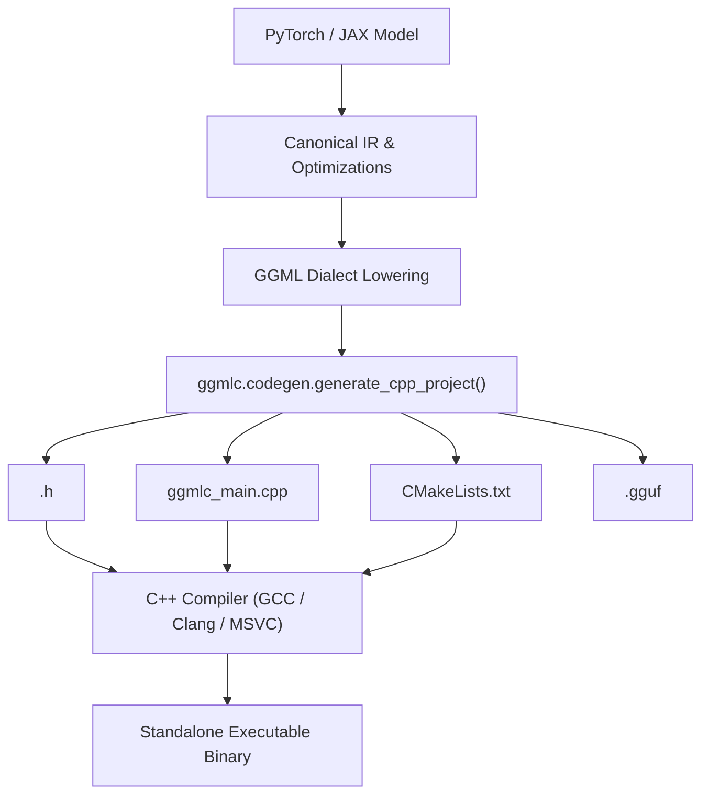

# Standalone C++ Code Generation in `ggmlc`

`ggmlc` provides an Ahead-Of-Time (AOT) **C++ Code Generator** (`ggmlc.codegen`) that compiles any PyTorch or JAX neural network graph into human-readable, self-contained C++ source code.

This enables deploying neural network models as standalone C++ binaries or embedding them directly into native applications (C/C++, iOS, Android, WASM, embedded devices) without requiring Python or generic runtime interpreters.

---

## 1. Overview & Architecture

When invoking `generate_cpp_project`, `ggmlc` performs:
1. Canonical IR translation and optimization pass execution.
2. Dialect lowering to GGML semantics.
3. Serialization of model parameters to a standard **GGUF v3** binary container.
4. Emission of a standalone C++ project directory:

```
<output_dir>/
├── <ModelName>.h        # Model definition, GGUF weight loader, and build_graph()
├── ggmlc_main.cpp       # CLI runner entry point with tensor I/O
└── CMakeLists.txt       # Build system linking GGML and OpenMP/Threads
```



---

## 2. Generated Code Structure

### A. Model Header (`<ModelName>.h`)
The generated header defines:
- **`struct <ModelName>Weights`**: Typed `struct ggml_tensor*` pointers for every model parameter.
- **`load_weights(ggml_context* ctx, gguf_context* gguf_ctx)`**: Reads parameter buffers directly from the GGUF container and assigns them to GGML weight handles.
- **`build_graph(ggml_context* ctx, const <ModelName>Weights& weights, ...)`**: Pure C-API graph construction constructing the computational DAG using `ggml_mul_mat`, `ggml_add`, `ggml_reshape_4d`, `ggml_permute`, and custom fused ops (`ggmlc_compute_forward_layer_norm`, `ggmlc_compute_forward_bias_gelu`, etc.).

#### Example Generated Header Snippet
```cpp
#pragma once
#include <map>
#include <string>
#include "ggml.h"
#include "gguf.h"

namespace minilm {

struct MiniLMWeights {
    struct ggml_tensor* w_0 = nullptr; // base_model.embeddings.word_embeddings.weight
    struct ggml_tensor* w_1 = nullptr; // base_model.encoder.layer.0.attention.self.query.weight
    // ...
};

inline MiniLMWeights load_weights(struct ggml_context* ctx, struct gguf_context* gguf_ctx) {
    MiniLMWeights w;
    int id_0 = gguf_find_tensor(gguf_ctx, "base_model.embeddings.word_embeddings.weight");
    if (id_0 >= 0) {
        w.w_0 = ggml_new_tensor_4d(ctx, GGML_TYPE_F32, 384, 30522, 1, 1);
        ggml_set_name(w.w_0, "base_model.embeddings.word_embeddings.weight");
        w.w_0->data = (char*)gguf_get_tensor_data(gguf_ctx, id_0);
    }
    return w;
}

inline struct ggml_cgraph* build_graph(
    struct ggml_context* ctx,
    const MiniLMWeights& weights,
    const std::map<int, struct ggml_tensor*>& inputs,
    const std::map<std::string, int64_t>& symbols) {
    
    struct ggml_cgraph* gf = ggml_new_graph(ctx);
    std::map<int, struct ggml_tensor*> tensors;

    // Map inputs
    for (const auto& [tid, t] : inputs) {
        tensors[tid] = t;
    }

    // Graph forward expansion
    tensors[12] = ggml_mul_mat(ctx, weights.w_1, tensors[11]);
    tensors[13] = ggml_add(ctx, tensors[12], weights.w_2);
    // ...
    ggml_build_forward_expand(gf, tensors[128]);
    return gf;
}

} // namespace minilm
```

### B. CLI Runner (`ggmlc_main.cpp`)
The generated runner provides a self-contained execution binary:
- Loads `<model_name>.gguf` with `gguf_init_from_file`.
- Allocates memory contexts for GGML execution.
- Reads input binary arrays passed via `--input <name>:<path.bin>`.
- Evaluates the graph with multi-threaded `ggml_graph_compute_with_ctx(ctx, gf, n_threads)`.
- Writes output tensors to disk via `--output <tensor_id>:<path.bin>`.

### C. Build Configuration (`CMakeLists.txt`)
A minimal, standalone CMake project linking against GGML:
```cmake
cmake_minimum_required(VERSION 3.14)
project(minilm_runner C CXX)

set(CMAKE_CXX_STANDARD 17)
set(CMAKE_CXX_STANDARD_REQUIRED ON)

find_package(Threads REQUIRED)

# Link GGML
include_directories(${GGML_INCLUDE_DIRS})
add_executable(minilm_runner ggmlc_main.cpp)
target_link_libraries(minilm_runner PRIVATE ggml Threads::Threads)
```

---

## 3. Python API Usage

```python
from examples.models.hub_models import load_minilm_model
from ggmlc.frontend.pytorch import export_torch_model
from ggmlc.codegen import generate_cpp_project

# 1. Load and export PyTorch model
model, sample_inputs, _ = load_minilm_model()
exported = export_torch_model(model, sample_inputs, model_name="MiniLM")

# 2. Generate C++ project
generate_cpp_project(
    exported_program=exported,
    output_dir="./build/generated/minilm",
    model_name="MiniLM",
    enable_fusion=True,
)
```

---

## 4. Building and Running the Generated Project

```bash
# 1. Configure and compile
cd build/generated/minilm
cmake -B build -DGGML_INCLUDE_DIRS=/path/to/ggml/include
cmake --build build --config Release

# 2. Run inference
./build/minilm_runner --model MiniLM.gguf --input input_ids:in.bin --threads 4 --output 128:out.bin
```
