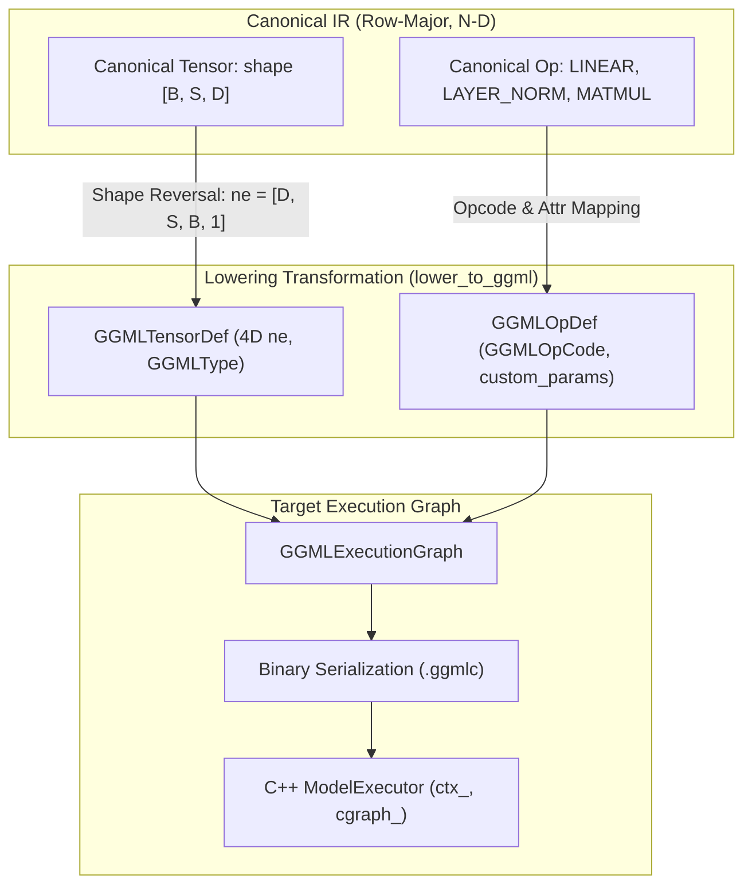

# GGML Dialect Specification & Lowering Semantics

The **GGML Dialect** translates high-level Canonical IR programs into concrete GGML execution graph representations (`GGMLExecutionGraph`), mapping mathematical tensor programs to GGML memory strides, column-major layouts, and SIMD kernel dispatch loops.



---

## 1. Dialect Graph Architecture (`GGMLExecutionGraph`)

The GGML Dialect represents execution-ready computation graphs with concrete 4D dimensions and memory layouts:

```python
@dataclass
class GGMLTensorDef:
    id: int
    name: str
    ggml_type: GGMLType
    ne: tuple[Dim, Dim, Dim, Dim]  # 4D dimensions [ne0, ne1, ne2, ne3]
    storage: StorageClass
    producer_id: int | None = None
    data: np.ndarray | None = None
    role: str | None = None

@dataclass
class GGMLOpDef:
    id: int
    opcode: GGMLOpCode
    inputs: list[int]
    outputs: list[int]
    attributes: dict[str, Any] = field(default_factory=dict)
    name: str | None = None

@dataclass
class GGMLExecutionGraph:
    name: str
    inputs: list[int] = field(default_factory=list)
    outputs: list[int] = field(default_factory=list)
    parameters: list[int] = field(default_factory=list)
    tensors: dict[int, GGMLTensorDef] = field(default_factory=dict)
    nodes: list[GGMLOpDef] = field(default_factory=list)
    symbol_table: list[str] = field(default_factory=list)
    metadata: dict[str, str] = field(default_factory=dict)
```

---

## 2. Memory Layout & Dimension Mapping Invariant

### A. The Row-Major to Column-Major Equivalence
- **PyTorch / JAX**: Row-major (C-order). Dimension $R-1$ has stride $1$ (contiguous in memory).
- **GGML**: Column-major (Fortran-order). `ne[0]` has stride $1$ (contiguous in memory).

### B. Translation Rule
For an $R$-dimensional Canonical IR tensor with shape $(d_0, d_1, \dots, d_{R-1})$:
$$ne = [d_{R-1}, d_{R-2}, \dots, d_0, 1, \dots, 1]$$

This mathematical equivalence guarantees that a 1D contiguous block of memory allocated in PyTorch maps byte-for-byte to the GGML buffer without requiring physical data transposition.

---

## 3. Axis Permutation & Transposition Mathematics

When translating a permutation $P$ from PyTorch (where $out\_dim[j] = in\_dim[P[j]]$) to GGML's `ggml_permute(ctx, a, axis0, axis1, axis2, axis3)`:

GGML's `ggml_permute` specifies where source axis `ne[i]` is placed in the destination tensor:
$$ne_{dst}[axis_i] = ne_{src}[i]$$

The exact formula converting PyTorch permutation $P$ of rank $R$ to GGML's `axis_i` is:
$$\text{dest\_axis}_i = R - 1 - P.\text{index}(R - 1 - i) \quad \text{for } 0 \le i < R$$
$$\text{dest\_axis}_i = i \quad \text{for } R \le i < 4$$

---

## 4. Matrix Multiplication Lowering (`GGML_OP_MUL_MAT`)

In GGML, `ggml_mul_mat(ctx, a, b)` computes:
$$\text{Output} = b \times a^T$$

### A. Linear Parameter Invariant
For PyTorch `Linear(in_features=K, out_features=N)` with weight $W(N, K)$:
- In memory, $W$ has GGML shape $ne = [K, N]$.
- Activation $x$ has GGML shape $ne = [K, M]$.
- Invoking `ggml_mul_mat(W, x)` computes $x(M, K) \times W^T(K, N) = (M, N)$, yielding GGML shape $ne = [N, M]$.
- This executes directly with zero transpose overhead.

### B. Activation-Activation MatMul Invariant ($Q \times K^T$ and $\text{Attn} \times V$)
When multiplying two non-transposed activation tensors $A(M, K)$ and $B(K, N)$:
- $A$ has $ne = [K, M]$.
- $B$ has $ne = [N, K]$.
- $B$ is transposed via `ggml_transpose(ctx, B)` to $ne = [K, N]$ (tagged with `attrs["transpose_in0"] = 1`).
- `ggml_mul_mat(transpose(B), A)` computes $A(M, K) \times B(K, N) = (M, N)$, preserving numerical accuracy.

---

## 5. Complete Dialect Opcode Mapping Table

| Canonical OpCode | GGML Dialect OpCode | GGML C API Call | Attribute Lowering / Notes |
| :--- | :--- | :--- | :--- |
| `ADD` | `GGML_OP_ADD (0)` | `ggml_add(ctx, a, b)` | Elementwise add |
| `SUB` | `GGML_OP_SUB (2)` | `ggml_sub(ctx, a, b)` | Elementwise sub |
| `MUL` | `GGML_OP_MUL (3)` | `ggml_mul(ctx, a, b)` | Elementwise mul |
| `DIV` | `GGML_OP_DIV (4)` | `ggml_div(ctx, a, b)` | Elementwise div |
| `SQR` | `GGML_OP_SQR (5)` | `ggml_sqr(ctx, a)` | Square |
| `SQRT` | `GGML_OP_SQRT (6)` | `ggml_sqrt(ctx, a)` | Square root |
| `LOG` | `GGML_OP_LOG (7)` | `ggml_log(ctx, a)` | Natural log |
| `SIN` / `COS` | `GGML_OP_SIN (8)` / `GGML_OP_COS (9)` | `ggml_sin` / `ggml_cos` | Trigonometric |
| `RELU` | `GGML_OP_UNARY (91)` | `ggml_unary(ctx, a, GGML_UNARY_OP_RELU)` | Unary activation |
| `GELU` | `GGML_OP_UNARY (91)` | `ggml_unary(ctx, a, GGML_UNARY_OP_GELU)` | Unary activation |
| `SILU` | `GGML_OP_UNARY (91)` | `ggml_unary(ctx, a, GGML_UNARY_OP_SILU)` | Unary activation |
| `TANH` | `GGML_OP_UNARY (91)` | `ggml_unary(ctx, a, GGML_UNARY_OP_TANH)` | Unary activation |
| `MATMUL` / `LINEAR` | `GGML_OP_MUL_MAT (10)` | `ggml_mul_mat(ctx, w, x)` | Matrix multiplication |
| `RESHAPE` / `VIEW` | `GGML_OP_RESHAPE (22)` | `ggml_reshape_4d(ctx, a, ne0, ne1, ne2, ne3)` | Logical view |
| `PERMUTE` | `GGML_OP_PERMUTE (24)` | `ggml_permute(ctx, a, ax0, ax1, ax2, ax3)` | Axis permutation |
| `TRANSPOSE` | `GGML_OP_TRANSPOSE (25)` | `ggml_transpose(ctx, a)` | 2D axis swap |
| `GET_ROWS` | `GGML_OP_GET_ROWS (26)` | `ggml_get_rows(ctx, w, idx)` | Embedding lookup |
| `REPEAT` | `GGML_OP_REPEAT (29)` | `ggml_repeat(ctx, a, b)` | Broadcast repeat |
| `SOFTMAX` | `GGML_OP_SOFT_MAX (46)` | `ggml_soft_max(ctx, a)` | Softmax along dim 0 |
| `ROPE` | `GGML_OP_ROPE (48)` | `ggml_rope(ctx, a, pos, n_dims, mode)` | Rotary embedding |
| `CONV_2D` | `GGML_OP_CONV_2D (56)` | `ggml_conv_2d(ctx, w, x, s0, s1, p0, p1, d0, d1)` | 2D convolution |
| `POOL_2D` | `GGML_OP_POOL_2D (61)` | `ggml_pool_2d(ctx, x, type, k0, k1, s0, s1, p0, p1)` | 2D max/avg pool |
| `FLASH_ATTN_EXT`| `GGML_OP_FLASH_ATTN_EXT (74)` | `ggml_flash_attn_ext(ctx, q, k, v, mask, scale)` | Flash attention |
| **`BIAS_GELU`** | **`GGML_OP_CUSTOM_BIAS_GELU (200)`** | `ggml_map_custom2(ctx, x, bias, ggmlc_compute_forward_bias_gelu)` | **Custom Fused Kernel** |
| **`LAYER_NORM`** | **`GGML_OP_CUSTOM_LAYER_NORM (201)`** | `ggml_map_custom3(ctx, x, w, b, ggmlc_compute_forward_layer_norm)` | **Custom Fused Kernel** |
| **`RMS_NORM`** | **`GGML_OP_CUSTOM_RMS_NORM (202)`** | `ggml_map_custom2(ctx, x, w, ggmlc_compute_forward_rms_norm)` | **Custom Fused Kernel** |
| **`SWIGLU`** | **`GGML_OP_CUSTOM_SWIGLU (203)`** | `ggml_map_custom2(ctx, gate, up, ggmlc_compute_forward_swiglu)` | **Custom Fused Kernel** |

---

## 6. Custom Fused Kernel Dispatch & Threading Specification

Custom operations ($200-203$) are dispatched via GGML's native custom map mechanism:

```cpp
void ggmlc_compute_forward_layer_norm(
    struct ggml_tensor* dst,
    const struct ggml_tensor* a,
    const struct ggml_tensor* w,
    const struct ggml_tensor* b,
    int ith,
    int nth,
    void* userdata
);
```

### Threading Semantics & Work Distribution
- `ith`: Thread index within GGML threadpool ($0 \le \text{ith} < \text{nth}$).
- `nth`: Total active threads allocated for execution.
- Work is distributed across token rows:
  ```cpp
  for (int64_t i01 = ith; i01 < ne01; i01 += nth) {
      // Vectorized row calculation over ne00 (hidden dimension)
  }
  ```

---

## 7. Quantization Layout Specifications

| Quantization Type | Block Size | Byte Footprint | Inner Computation |
| :--- | :--- | :--- | :--- |
| `GGML_TYPE_Q8_0` | 32 elements | 34 bytes ($32 \times 1\text{B} + 1\times\text{FP16}$) | Int8 dot-product with FP16 scale |
| `GGML_TYPE_Q4_0` | 32 elements | 18 bytes ($32 \times 0.5\text{B} + 1\times\text{FP16}$) | 4-bit nibble dot-product with FP16 scale |

Weights are strictly arranged in contiguous row-major blocks along dimension 0 ($ne0$) to allow unaligned AVX2/NEON vector loads.
