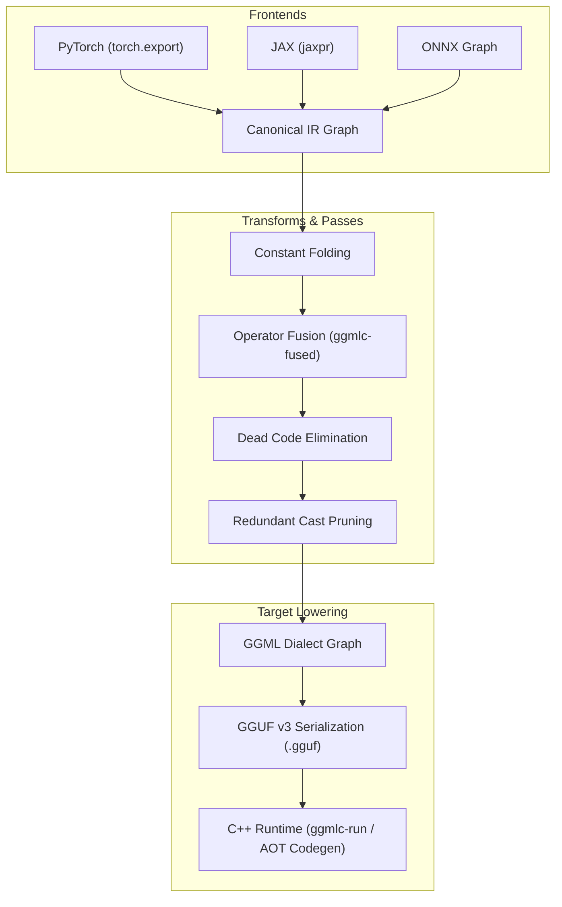
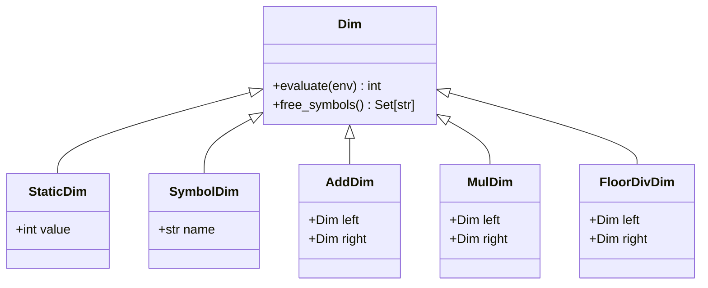

# Canonical Intermediate Representation (Canonical IR) Specification

The `ggmlc` **Canonical IR** is a strongly-typed, framework-independent, functional intermediate representation designed to model neural networks as semantic tensor programs.



---

## 1. Core Architectural Tenets

1. **A Neural Network is a Functional Tensor Program**: Every operation in the IR represents a deterministic mathematical transformation mapping input tensor identifiers to output tensor identifiers.
2. **Framework Agnosticism**: The IR contains zero PyTorch, JAX, or vendor-specific abstractions. An exported ResNet, Transformer, or ConvNet produces an identical Canonical IR graph regardless of origin.
3. **First-Class Dynamic Symbolic Shapes**: Dimensions are represented as symbolic mathematical expressions ($B, S, \lceil S / 32 \rceil, 2 \times D$) evaluated at runtime based on input symbol environments.
4. **Explicit Storage Classes & Lifetimes**: Every tensor is tagged with an explicit storage category (`INPUT`, `PARAMETER`, `CONSTANT`, `ACTIVATION`, `STATE`, `OUTPUT`), allowing deterministic static memory arena planning.
5. **Composability for Transformation Passes**: Clean DAG structure enabling single-pass and fixed-point graph transformations.

---

## 2. Graph Data Structure & Grammar

A Canonical IR Graph is defined as:

$$\mathcal{G} = \langle \mathcal{T}, \mathcal{O}, \mathcal{S}, \mathcal{I}, \mathcal{P}, \mathcal{X}, \mathcal{M} \rangle$$

Where:
- $\mathcal{T} = \{t_1, t_2, \dots, t_N\}$: Set of all tensors in the program.
- $\mathcal{O} = \{o_1, o_2, \dots, o_M\}$: Topologically sorted list of computational operations.
- $\mathcal{S} = \{s_1, \dots\}$: Declarations for persistent mutable state (e.g. KV-Cache buffers).
- $\mathcal{I} \subset \mathbb{N}$: Ordered list of input tensor IDs.
- $\mathcal{P} \subset \mathbb{N}$: Ordered list of parameter tensor IDs (weights/biases).
- $\mathcal{X} \subset \mathbb{N}$: Ordered list of output tensor IDs.
- $\mathcal{M}$: Metadata dictionary (model name, source framework, version).

### Concrete Python Structure

```python
@dataclass
class Graph:
    name: str = "main"
    inputs: list[int] = field(default_factory=list)
    outputs: list[int] = field(default_factory=list)
    parameters: list[int] = field(default_factory=list)
    states: list[StateDeclaration] = field(default_factory=list)
    nodes: list[Operation] = field(default_factory=list)
    tensors: dict[int, Tensor] = field(default_factory=dict)
    metadata: dict[str, str] = field(default_factory=dict)
```

---

## 3. Type System (`DType`)

Every tensor in Canonical IR carries an explicit data type enumeration:

| Enum Name | Primitive Type | Size | Quantized | Description |
| :--- | :--- | :--- | :--- | :--- |
| `DType.F32` | IEEE 754 float32 | 4 bytes | No | Standard single-precision floating point |
| `DType.F16` | IEEE 754 float16 | 2 bytes | No | Standard half-precision floating point |
| `DType.BF16` | bfloat16 | 2 bytes | No | Brain floating point (8-bit exponent) |
| `DType.I32` | int32 | 4 bytes | No | Signed 32-bit integer |
| `DType.I64` | int64 | 8 bytes | No | Signed 64-bit integer (indices, token IDs) |
| `DType.I16` | int16 | 2 bytes | No | Signed 16-bit integer |
| `DType.I8` | int8 | 1 byte | No | Signed 8-bit integer |
| `DType.BOOL` | uint8 | 1 byte | No | Boolean predicate mask |
| `DType.Q8_0` | Block quantized | 34 bytes / 32 elements | Yes | 8-bit symmetric quantization with FP16 scale |
| `DType.Q4_0` | Block quantized | 18 bytes / 32 elements | Yes | 4-bit symmetric quantization with FP16 scale |
| `DType.Q4_K` | Super-block | Variable | Yes | 4-bit k-quantization with 8-bit scales |

---

## 4. Symbolic Shape Engine (`Dim`, `Shape`)

Shapes in Canonical IR are represented as lists of `Dim` expressions:

$$\text{Shape} = [d_0, d_1, \dots, d_{R-1}]$$



### Expression Evaluation
Given an environment `env = {"batch": 1, "seq": 128}`:
- `StaticDim(768).evaluate(env) -> 768`
- `SymbolDim("seq").evaluate(env) -> 128`
- `MulDim(SymbolDim("batch"), SymbolDim("seq")).evaluate(env) -> 128`
- `FloorDivDim(SymbolDim("seq"), StaticDim(32)).evaluate(env) -> 4`

---

## 5. Tensor Definition & Storage Classes

Each tensor has an explicit `StorageClass`:

```python
@dataclass
class Tensor:
    id: int
    name: str
    shape: Shape
    dtype: DType
    storage: StorageClass
    producer_id: int | None = None
    data: np.ndarray | None = None
    role: str | None = None
```

### Storage Lifecycle Semantics

| Storage Class | Allocated By | Lifetime | Arena Reusable |
| :--- | :--- | :--- | :--- |
| `INPUT` | Caller | Active during single inference call | No |
| `PARAMETER` | Binary Loader | Static for model instance lifetime | No (Read-Only) |
| `CONSTANT` | Binary Loader | Static for model instance lifetime | No (Read-Only) |
| `ACTIVATION` | Memory Arena | Ephemeral between producer and last consumer | **Yes ($18\times-51\times$ reuse)** |
| `STATE` | State Manager | Persistent across consecutive inference steps | No (Read-Write State) |
| `OUTPUT` | Memory Arena / Caller | Active until caller reads execution results | No |

---

## 6. Complete Canonical Operator Vocabulary (`OpCode`)

### A. Elementwise Arithmetic & Unary Math
- **`ADD(a, b) -> y`**: Elementwise addition $y = a + b$.
- **`SUB(a, b) -> y`**: Elementwise subtraction $y = a - b$.
- **`MUL(a, b) -> y`**: Elementwise multiplication $y = a \odot b$.
- **`DIV(a, b) -> y`**: Elementwise division $y = a / b$.
- **`NEG(a) -> y`**: Elementwise negation $y = -a$.
- **`POW(a, exp) -> y`**: Exponentiation $y = a^{\text{exp}}$.
- **`SQRT(a) -> y`**, **`RSQRT(a) -> y`**: Square root $\sqrt{a}$ and inverse square root $1/\sqrt{a}$.
- **`EXP(a) -> y`**, **`LOG(a) -> y`**: Natural exponential and natural logarithm.
- **`SIN(a) -> y`**, **`COS(a) -> y`**: Trigonometric functions.
- **`CLAMP(a) -> y`**: Value clamping with attributes `min`, `max`.

### B. Neural Network Activations & Normalizations
- **`RELU(a) -> y`**: Rectified linear unit $y = \max(0, a)$.
- **`GELU(a) -> y`**: Gaussian error linear unit $y = 0.5 a (1 + \tanh(\sqrt{2/\pi}(a + 0.044715 a^3)))$.
- **`BIAS_GELU(a, bias) -> y`**: Fused linear bias addition and GELU activation $y = \text{GELU}(a + \text{bias})$.
- **`SILU(a) -> y`**: Sigmoid linear unit $y = a / (1 + e^{-a})$.
- **`SIGMOID(a) -> y`**, **`TANH(a) -> y`**: Standard activations.
- **`SOFTMAX(a) -> y`**: Softmax reduction with attribute `dim`.
- **`LAYER_NORM(x, weight, bias) -> y`**: Fused Layer Normalization with attribute `eps`.
- **`RMS_NORM(x, weight) -> y`**: Root Mean Square Normalization with attribute `eps`.
- **`SWIGLU(gate, up) -> y`**: Fused SwiGLU gating $y = \text{SiLU}(\text{gate}) \odot \text{up}$.

### C. Linear Algebra & Dense Matrix Operations
- **`MATMUL(a, b) -> y`**: General matrix multiplication $y = a \times b$.
- **`LINEAR(x, w, bias) -> y`**: Dense linear layer with optional bias.
- **`CONV2D(x, w, bias) -> y`**: 2D Spatial convolution with attributes `stride_h, stride_w, pad_h, pad_w`.
- **`MAX_POOL2D(x) -> y`**, **`AVG_POOL2D(x) -> y`**: 2D Spatial pooling.
- **`ADAPTIVE_AVG_POOL2D(x) -> y`**: Global or target-size adaptive pooling.

### D. Tensor Layout & Manipulation Operations
- **`RESHAPE(a) -> y`**, **`VIEW(a) -> y`**: Logical shape reinterpretation.
- **`TRANSPOSE(a) -> y`**: 2D or N-D axis swap with attribute `dim0, dim1`.
- **`PERMUTE(a) -> y`**: Arbitrary rank rearrangement with attribute `dims: list[int]`.
- **`SLICE(a) -> y`**: Tensor slicing with attributes `dim, start, end, step`.
- **`CONCAT(a, b, ...) -> y`**: Tensor concatenation along attribute `dim`.
- **`SPLIT(a) -> (y1, y2, ...)`**: Tensor splitting along attribute `dim`.
- **`REPEAT(a) -> y`**, **`EXPAND(a) -> y`**: Dimension broadcast repetition.
- **`SQUEEZE(a) -> y`**, **`UNSQUEEZE(a) -> y`**: Unit dimension elimination or insertion.
- **`CONTIGUOUS(a) -> y`**: Enforces physical row-major memory continuity.
- **`EMBEDDING(indices, weight) -> y`**: Embedding table lookup.
- **`ROPE(x) -> y`**: Rotary positional embedding with attributes `n_dims, mode`.
- **`SDPA(q, k, v, mask) -> y`**: Scaled Dot-Product Attention with attribute `scale`.
