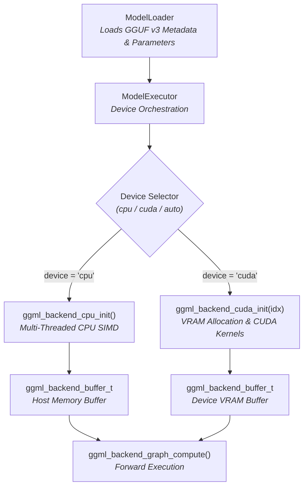

# C++ Generic Runtime Architecture

The `ggmlc` C++ runtime (`ggmlc_runtime`) is a high-performance, lightweight execution engine that evaluates compiled **GGUF v3** neural network graphs using the underlying GGML library and the **GGML Backend API**.

---

## 1. Design Overview

`ggmlc` provides two complementary execution strategies:
1. **Generic Graph Interpreter (`ggmlc-run` & Python `ModelRunner`)**:
   - **Multi-Device Hardware Acceleration**: Direct execution on **multi-threaded CPU** and **NVIDIA GPUs (CUDA)** via GGML backend abstractions (`ggml_backend_t` / `ggml_backend_buffer_t`).
   - **Zero dynamic code compilation**: The runtime binary `ggmlc-run` and Python extension `_runtime` are compiled once and can execute any `.gguf` model artifact.
   - **Standard GGUF v3 container**: Graph topologies and dynamic shape expressions are stored losslessly as JSON metadata in `ggmlc.graph_spec`, while parameter buffers are stored with 32-byte alignment.
   - **Deterministic memory planning**: Context memory is calculated dynamically during `prepare()` and allocated into high-performance backend device buffers via `ggml_backend_alloc_ctx_tensors`.
   - **Dynamic shape binding**: Symbolic dimensions (e.g. batch size, sequence length) are evaluated dynamically from runtime environment dictionaries or CLI flags.
   - **Persistent state buffers**: Stateful memory (`StorageClass.STATE`) persists across sequential inference invocations for autoregressive decoding on both host and device memory.
   - **Hardware-accelerated quantized execution**: Direct SIMD kernel execution (AVX2, AVX-512, ARM NEON) and GPU tensor kernels for `Q4_0` and `Q8_0` quantized models.

2. **Standalone Ahead-Of-Time (AOT) C++ Code Generation (`ggmlc.codegen`)**:
   - Compiles any model graph into pure C++ source files (`<Model>.h`, `ggmlc_main.cpp`, `CMakeLists.txt`) for embedding directly into native applications with dual CPU/CUDA backend support. (See [C++ Code Generation Guide](../codegen/cpp_codegen.md)).

---

## 2. Hardware Device Management & Backend Architecture

The runtime interfaces with hardware via GGML's backend API:



### Supported Execution Devices
- `cpu`: Evaluates the forward graph on multi-core CPU using OpenMP / pthread thread pools.
- `cuda` / `cuda:0` / `cuda:N`: Evaluates the computation graph entirely on the specified NVIDIA GPU (Pascal GTX 1050 through Hopper architectures).
- `auto`: Automatically detects available GPUs via `ggml_backend_cuda_get_device_count()`, selecting `cuda:0` if available and falling back to `cpu`.

---

## 3. Core Runtime Classes

### `ModelLoader` (`runtime/src/loader.cpp`)
Responsible for reading GGUF v3 binary files into in-memory `SerializedModelGraph` structures:
- Initializes the GGUF reader context via `gguf_init_from_file` or `gguf_init_from_bytes`.
- Extracts `ggmlc.graph_spec` string metadata containing the JSON DAG specification (nodes, inputs, outputs, tensor metadata, dynamic shapes, and storage classes).
- Parses tensor tables, storage classes, and dimension expression trees (`DimExpr`).
- Maps raw parameter and constant weight memory pointers directly from the GGUF container with 32-byte alignment.

### `ModelExecutor` (`runtime/src/executor.cpp`)
Main runtime orchestrator:
- `ModelExecutor(graph, device="cpu")`:
  - Queries available devices (`ModelExecutor::get_available_devices()`).
  - Initializes the target backend handle `backend_` (`ggml_backend_cpu_init()` or `ggml_backend_cuda_init(device_idx)`).
- `prepare(symbol_env)`:
  1. Recursively evaluates all `DimExpr` trees against the supplied `symbol_env` map to produce concrete 4D tensor shapes `concrete_shapes_[tensor_id]`.
  2. Initializes a `no_alloc = true` GGML context `ctx_` and builds graph tensor descriptors.
  3. Emits forward computation nodes (supporting fused ops like `bias+GELU`, `LayerNorm`, `RMSNorm`, `SwiGLU` natively on CUDA or multi-threaded CPU).
  4. Allocates tensor memory on the backend device buffer via `ggml_backend_alloc_ctx_tensors(ctx_, backend_)`.
  5. Transfers model parameters, constants, and initial states to the backend buffer via `ggml_backend_tensor_set`.
- `set_input(tensor_id, data, size)` / `set_input_by_name(name, data, size)`: Transfers input buffers into device/host tensor memory with shape/size verification.
- `set_state(tensor_id, data, size)` / `set_state_by_name(name, data, size)`: Explicitly sets or restores persistent state buffers on the device.
- `run(n_threads)`: Configures CPU thread pool (if running on CPU) and executes `ggml_backend_graph_compute(backend_, cgraph_)`.
- `get_output_data(tensor_id)`: Streams computed output tensor data from device VRAM to host memory via `ggml_backend_tensor_get`.
- `get_state_data(tensor_id)` / `get_state_data_by_name(name)`: Synchronizes persistent state buffers back to host memory.

---

## 4. CLI Runner (`ggmlc-run`)

```bash
ggmlc-run <model.gguf> [options]
```

### Supported CLI Options
- `--device <cpu|cuda|auto>`: Hardware execution target (default: `cpu`).
- `--threads <N>`: Sets the number of CPU execution threads (default: `4`).
- `--input <name:file.bin>`: Loads input tensor from binary file.
- `--output <id:file.bin>`: Writes output tensor to binary file.
- `--state-in <name:file.bin>`: Loads initial state tensor from binary file.
- `--state-out <name:file.bin>`: Writes final state tensor to binary file.
- `--symbol <name=value>`: Binds a dynamic symbolic dimension (e.g. `--symbol batch=4 --symbol seq=32`).

---

## 5. C++ API Embedding Example

```cpp
#include "ggmlc/loader.h"
#include "ggmlc/executor.h"
#include <iostream>

// 1. Check available hardware devices
auto devices = ggmlc::ModelExecutor::get_available_devices();
for (const auto& dev : devices) {
    std::cout << "Available device: " << dev << std::endl;
}

// 2. Load compiled model graph from GGUF container
auto model_graph = ggmlc::ModelLoader::load_from_file("minilm_q4.gguf");

// 3. Instantiate executor on GPU (or "cpu" / "auto")
ggmlc::ModelExecutor executor(model_graph, /*device=*/"cuda:0");
executor.prepare({{"batch", 1}, {"seq", 16}});

// 4. Set input data (automatically uploaded to device VRAM)
std::vector<float> input_tokens(1 * 16 * 384, 1.0f);
executor.set_input_by_name("input_ids", input_tokens.data(), input_tokens.size() * sizeof(float));

// 5. Run forward pass on GPU
executor.run(/*n_threads=*/1);

// 6. Read output tensor (automatically fetched from device VRAM)
uint32_t out_id = model_graph.outputs[0];
const float* out_ptr = reinterpret_cast<const float*>(executor.get_output_data(out_id));
```
